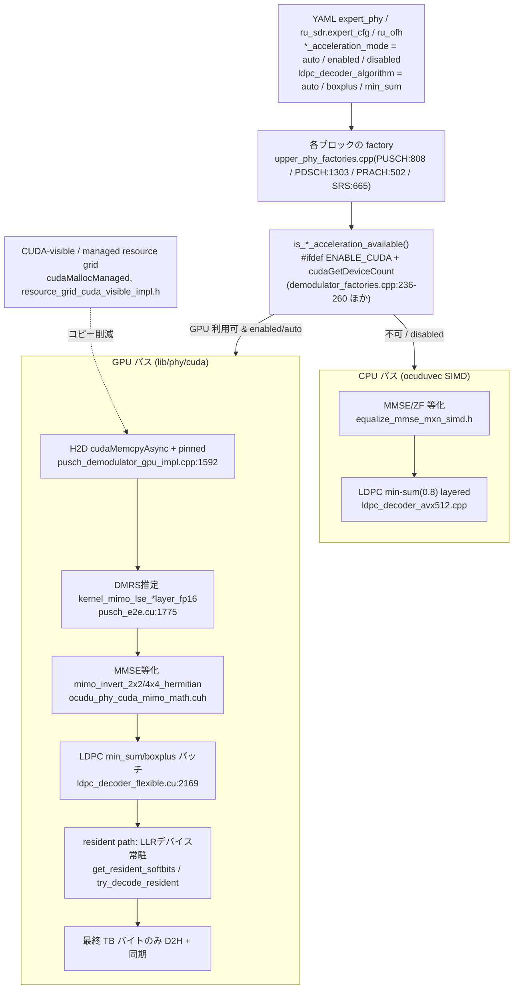

# OCUDU L1 CPU/GPU 実装調査 — CUDA Accelerated OCUDU (26.04) ソースコード精査

| 項目 | 内容 |
|---|---|
| 対象 | `cuda_accelerated_ocudu`(OCUDU 26.04 の CUDA 対応 fork、ブランチ `cuda_accel.26_04`) |
| バージョン | OCUDU 26.04.0(`cmake/modules/version.cmake`)/ CPU SIMD + 同一ツリー内 CUDA L1(`lib/phy/cuda/`) |
| 出自 | Co-authored: Tim O'Shea / Wan Liu(DeepSig)。CUDA 加速を本流 OCUDU へ upstream する preview release(`README.md:1-48`) |
| 調査方法 | ソースコードの静的精査。各主張に `ファイルパス:行` と関数名を併記(パスはリポジトリルート相対)。未確認は「未確認(要確認)」と明記 |
| 作成日 | 2026-06-15 |

> 凡例:`ファイルパス:行`はクローン時点(`cuda_accel.26_04`)の行番号。CUDA カーネルは `__global__`、デバイス関数は `__device__`。

---

## 目次

- [総括(エグゼクティブサマリ)](#総括エグゼクティブサマリ)
- [A. MMSE等化(UL復調)の実装実体【CPU】](#a-mmse等化ul復調の実装実体cpu)
- [B. ビームフォーミング重み(BFW)の搭載状況【CPU】](#b-ビームフォーミング重みbfwの搭載状況cpu)
- [C. LDPCデコーダの実装方式【CPU】](#c-ldpcデコーダの実装方式cpu)
- [D. GPU(CUDA L1)の実装と統合【GPU】](#d-gpucuda-l1の実装と統合gpu)
- [E. ベンチマーク資産の棚卸し【CPU & GPU】](#e-ベンチマーク資産の棚卸しcpu--gpu)
- [CPU vs GPU 比較設計メモ](#cpu-vs-gpu-比較設計メモ)

---

## 総括(エグゼクティブサマリ)

本 fork は、OCUDU 26.04 の CPU SIMD 実装(srsRAN 系の `ocuduvec` ベース)に、`lib/phy/cuda/` の **in-tree CUDA カーネルライブラリ `ocudu_phy_cuda`** を重ねた構成である。公開 C API は `lib/phy/cuda/include/ocudu_phy_cuda.h`、OCUDU 側の C++ アダプタは通常の PHY/OFH 実装ディレクトリに残し、既存のファクトリ/セレクタ抽象を保ったまま CUDA backend を選べるようにしている(`lib/phy/cuda/README.md:1-31`)。

3つの重点テーマの要点は以下:

- **A. MMSE等化(CPU)**:`channel_equalizer_generic_impl` が ZF/MMSE を実装。**専用の手書き intrinsic は使わず、すべて `ocuduvec` の共通 SIMD API(`simd.h`)経由**。MMSE は Gram 行列対角に雑音分散を加算する正則化逆行列方式。**IRC(相関雑音行列)は非対応**。最大 4 レイヤ × 8 受信ポート。
- **B. BFW(CPU)**:**「適用(precoding 行列適用)」のみ搭載、「生成」は未搭載**。重み行列は 3GPP コードブック(`precoding_codebooks.cpp`)を初期化し、スケジューラが PMI/TPMI を「選択」して FAPI 経由で PHY に渡す。`MAX_NOF_PORTS=4 / MAX_NOF_LAYERS=4`(`precoding_constants.h`)で **Massive MIMO 非対応**。OFH C-plane の重み系セクション(type5/6)・beam id も未実装。
- **C. LDPCデコーダ(CPU)**:**正規化 min-sum(スケーリング係数 0.8)+ layered**。AVX-512 版は int8 LLR を 64B レジスタで CN/VN ベクトル化し、マスクレジスタ(`__mmask64`, `_kandn_mask64`)を活用。early termination は CRC/シンドロームで実装。
- **D. GPU(CUDA L1)**:LDPC(enc/dec)・変調/復調・スクランブル・レートマッチ・CRC・Polar・TB分割・DMRS チャネル推定・**MMSE等化**・PRACH 検出・SRS 推定・OFH 圧縮を CUDA 化。FFT/IFFT は **VkFFT** に委譲(自前 FFT カーネルは持たず前後処理のみ)。**GPU LDPC は CPU と異なり INT8 min-sum と FP16 boxplus(真の sum-product)の両対応**で、`ldpc_decoder_algorithm` で選択。**BFW 生成は GPU 側にも無し**。backend は `*_acceleration_mode`(auto/enabled/disabled)+ `ENABLE_CUDA` + 実行時 `cudaGetDeviceCount` で選択。データ移動は `cudaMemcpyAsync`+pinned+managed grid、PUSCH は LLR をデバイス常駐させる "resident path" でホスト往復を削減、LDPC は CB をバッチ一括(1回の H2D/カーネル/D2H/同期)。

CPU/GPU の対応関係(A/B/C のテーマが GPU でどこまでカバーされるか):

| テーマ | CPU 側 | GPU 側 | 備考 |
|---|---|---|---|
| MMSE 等化 | ZF/MMSE、ocuduvec SIMD、最大4×8、IRC無 | あり(`ocudu_phy_cuda_mimo_math.cuh`、2×2/4×4 Hermitian 逆行列、FP16) | GPU は PUSCH e2e に融合 |
| BFW 生成 | 無(適用のみ) | 無(適用も DL precoding は CPU/grid 側) | 双方とも生成は非搭載 |
| LDPC | min-sum(0.8)のみ、AVX-512/AVX2/NEON/generic | min-sum(INT8)+ **boxplus(FP16, SPA)**、layered、BG1/BG2 | GPU のみ boxplus を追加 |

### 図1: backend ディスパッチとデータ経路(PUSCH UL を例に)



---

## A. MMSE等化(UL復調)の実装実体【CPU】

### 結論

**専用実装(ただし手書き intrinsic ではなく `ocuduvec` 共通 SIMD API 経由)**。アルゴリズムは **ZF と MMSE**(線形等化)で、**IRC は非対応**。行列演算(Gram 行列 → 逆行列 → 等化)は `simd.h` の複素 SIMD プリミティブで構成され、x86(SSE4.1/AVX2/AVX-512)・Arm(NEON)へコンパイル時に展開、スカラフォールバックも全パスに存在する。最大 4 レイヤ × 8 受信ポート。

### 根拠(file:行 / 関数)

- 実装の中核クラス:`channel_equalizer_generic_impl`(`lib/phy/upper/equalization/channel_equalizer_generic_impl.h:16`、`max_nof_ports=8`)。ディスパッチ本体は `channel_equalizer_generic_impl.cpp:511-653`。
- アルゴリズム(`include/ocudu/phy/upper/equalization/channel_equalizer_algorithm_type.h` の enum: ZF, MMSE):
  - MMSE 一般 MxN:`equalize_mmse_mxn_simd.h:14`(テンプレート `<NofLayers, NofPorts>`)。
  - ZF 一般 MxN:`equalize_zf_mxn_simd.h`、SIMO/2層特化 `equalize_zf_1xn.h` / `equalize_zf_2xn.h`。
- 雑音分散の投入(MMSE 正則化):`equalize_mmse_mxn_simd.h:23` で `noise_var_simd = ocudu_simd_cf_set1(noise_var_est)`、`:34` で Gram 行列対角へ加算(`h_gram[i][i] += noise_var_simd`)→ (HᴴH + σ²I)⁻¹。ZF は Gram 逆行列の対角から雑音分散を導出(`equalize_zf_mxn_simd.h`)。
- 行列演算ヘルパ:
  - Gram 行列 `squared_gram_matrix<N,M>()`(`gram_matrix.h:15`):`out[i][j] = Σ_k conjprod(in[k][i], in[k][j])`。
  - 逆行列 `squared_matrix_inverse<N>()`(`matrix_inverse.h:72`、Gauss-Jordan)。
- 使用する `ocuduvec` API(すべて `include/ocudu/ocuduvec/simd.h`):`ocudu_simd_cf_conjprod()`(`:1003`)、`ocudu_simd_cf_norm_sq()`(`:1078`)、`ocudu_simd_f_precise_rcp()`(`:390`、Newton-Raphson 1反復)、`ocudu_simd_cf_select()`(`:1655`、異常値処理ブレンド)、`ocudu_simd_cf_mul()`。**`equalization/` 配下に `immintrin.h`/`arm_neon.h` の直接 include は無く**、SIMD はすべて `simd.h` 抽象化経由。
- IRC:`IRC`/`interference rejection`/相関(covariance)行列の実装は **無し**(`equalization/` 全文検索でヒット無し)。
- スケール方法:RE 単位の外ループ内で 1反復あたり `OCUDU_SIMD_CF_SIZE` 個(AVX-512=16/AVX2=8/SSE・NEON=4)の RE を並列処理し、端数はスカラ(`channel_equalizer_generic_impl.cpp:243-274`)。入力は SoA(`ch_symbols[port]`, `h[port][layer]`)、出力はレイヤ×RE インターリーブ(`interleave_layers.h:26`)。次元はテンプレート特化(1×N/2×N + 一般 3×4…4×8)。
- ファクトリ:`create_channel_equalizer_generic_factory()`(`equalization_factories.cpp:29`、既定 ZF)。1 レイヤ時 MMSE は ZF と等価(`channel_equalizer_generic_impl.cpp:591-596`)。
- 対応次元の確認:`tests/unittests/phy/upper/equalization/channel_equalizer_support.cpp:61`(layers≤4 かつ ports∈{1,2,4,8} かつ layers≤ports)。

### 補足

CPU 等化は「専用クラス + 共通 SIMD ライブラリ」型で、LDPC 等のように `*_avx512.cpp` のアーキ別ソースを持たない。ベクトル幅はビルド時 ISA で決まり、ランタイム選択ではない。IRC 非対応のため、強い同一チャネル干渉(隣接セル等)下の UL 性能は MMSE 上限に律速される。

---

## B. ビームフォーミング重み(BFW)の搭載状況【CPU】

### 結論

**「適用のみ」搭載 / 「生成」は未搭載**。DU/L1 は 3GPP コードブックから選ばれた precoding 行列を「適用」するだけで、チャネルから重みを計算(SVD/固有ベクトル/MRT/SLNR 等)する処理は持たない。**Massive MIMO 規模(数十〜数百アンテナ)は非対応**(4×4 上限)。O-RAN OFH の重みベース BF(C-plane section type5/6、beam id)も未実装。

### 根拠(file:行 / 関数)

- precoding「適用」:`channel_precoder` の `apply_precoding()` / `apply_layer_map_and_precoding()`(`include/ocudu/phy/generic_functions/precoding/channel_precoder.h`)。SIMD 実装は `channel_precoder_{generic,avx2,avx512,neon}.cpp`。呼び出し元 `resource_grid_mapper_impl.cpp:166, 217`。
- 重みの出所(生成ではなく選択 + テーブル参照):
  - 重み行列は config 内 `precoding_configuration` から取得(`resource_grid_mapper_impl.cpp:60`)。PDSCH PDU 側のフィールドは `tx_precoding_and_beamforming_pdu`(`include/ocudu/fapi/p7/messages/dl_pdsch_pdu.h:99`)。FAPI 経由で MAC/スケジューラ → PHY。
  - コードブックは 3GPP TS38.214 の固定テーブルを生成(初期化):`lib/ran/precoding/precoding_codebooks.cpp:11-52`(`make_one_layer_two_ports`, `make_two_layer_two_ports`, `make_four_layer_four_ports_type1_sp` 等)、FAPI 用は `lib/fapi_adaptor/precoding_matrix_table_generator.cpp:17-94`。
  - スケジューラは PMI/TPMI を「選択」:DL は `ue_channel_state_manager::get_precoding()`(`lib/scheduler/ue_context/ue_channel_state_manager.h:25-64`)で UE 報告 PMI を記録(`ue_channel_state_manager.cpp:46-51`)。UL は `get_tpmi_select_info()`(`include/ocudu/ran/pusch/pusch_tpmi_select.h:74-77`)で SRS チャネル行列からコードブック内最適 TPMI を選択(`ue_channel_state_manager.cpp:70-72`)。いずれも codebook からの選択であり新規重み計算ではない。
- 生成アルゴリズムの不在:`SVD`/`eigenvalue`/`eigenvector`/`MRT`/`SLNR` はリポジトリ全文検索で 0 件(送信側 BF 重み計算なし。ZF/MMSE は受信側等化のみ)。
- Massive MIMO 非対応:`include/ocudu/ran/precoding/precoding_constants.h:21-24`(`MAX_NOF_LAYERS=4`, `MAX_NOF_PORTS=4`)、`precoding_weight_matrix` も 4×4 を assert(`include/ocudu/ran/precoding/precoding_weight_matrix.h:34-47`)。
- OFH の BF:C-plane は section type 0/1/3 のみ(`lib/ofh/serdes/ofh_cplane_message_properties.h:19-27`)。beam identifier は明示的に未対応(`lib/ofh/serdes/ofh_cplane_message_builder_impl.cpp:100-105`、コメント "No beam support")。eAxC はストリームのルーティング ID であり重みではない。

### 補足

すなわち本実装は O-RAN の Category A 相当(precoding/BF は基本的に DU 内のコードブック適用、もしくは RU 側で重み適用)に整合し、CSI/PMI フィードバックに基づくコードブックベースのクローズドループ MIMO までをカバーする。アナログ/デジタル BF 重み生成や reciprocity ベースの大規模 BF はスコープ外(未搭載)。

---

## C. LDPCデコーダの実装方式【CPU】

### 結論

**正規化 min-sum(normalized min-sum、スケーリング係数 0.8)+ layered(行ごと逐次更新)**。SPA(boxplus)や flooding ではない。AVX-512/AVX2/NEON/generic の 4 実装を持ち、起動時に CPU 機能検出で選択。early termination(CRC/シンドローム)あり。

### 根拠(file:行 / 関数)

- アルゴリズム:
  - min-sum(第1最小・第2最小・符号積を追跡):`ldpc_decoder_impl.cpp:250-326`(`update_check_to_variable_messages()`)、`ldpc_decoder_generic.cpp:28-90`(`analyze_var_to_check_msgs()`)。
  - スケーリング係数 0.8(正規化 min-sum):`ldpc_decoder_impl.h:185`(`float scaling_factor = 0.8`)、適用は `ldpc_decoder_generic.cpp:52-61`(`scale_llr()`)。
  - layered(レイヤ毎に V2C→C2V→soft 更新):`ldpc_decoder_impl.cpp:101-109`。
- AVX-512 版のベクトル化(`ldpc_decoder_avx512.cpp`):LLR は int8、レジスタ 64B(`simd_support.h:22` `AVX512_SIZE_BYTE`)。
  - CN 処理:`:111-153`(`_mm512_abs_epi8`, `_mm512_cmpgt_epi8_mask`+`_mm512_mask_blend_epi8`, 符号積 `_mm512_xor_si512` @ :129)。
  - VN/soft 更新:`:212-253`(飽和加算 `_mm512_adds_epi8` @ :232、無限大伝播をマスク論理 `_kandn_mask64`/`_kor_mask64` @ :237-248)。
  - V2C 飽和減算:`:69-109`(`_mm512_subs_epi8` → `_mm512_min/max_epi8`)。
  - スケーリング:`avx512_support.h:47-89`(`scale_epi8()`、16bit 中間で int8 乗算)。
- AVX2/generic との差分:AVX2 は 32B レジスタ、マスクレジスタ非使用で全ビットマスク + `_mm256_blendv_epi8`(処理単位 32 LLR)。generic はスカラ。`simd_span` ラッパは `simd_support.h:31-150`、AVX-512 特化 `avx512_support.h:35-40`。
- early termination:`ldpc_decoder_impl.cpp:112-128`(CRC 一致 or シンドローム成立で反復番号を返して打ち切り)、`check_syndrome()`(`:349-409`)。`early_stop_syndrome`(`ldpc_decoder_impl.h:218`)。
- デコードのエントリ:`ldpc_decoder::decode()`(`include/ocudu/phy/upper/channel_coding/ldpc/ldpc_decoder.h:57-58`)、実装 `ldpc_decoder_impl.cpp:41-145`。
- 実装切替:`create_ldpc_decoder_factory_sw()`(`lib/phy/upper/channel_coding/channel_coding_factories.cpp:84-148`)。選択ロジック `:98-113`(文字列 `auto`/`avx512`/`avx2`/`neon`/`generic` × `cpu_supports_feature(avx512f && avx512bw)` 等)。CMake ファイル単位フラグ:`lib/phy/upper/channel_coding/ldpc/CMakeLists.txt:19-31`(`-mavx512f;-mavx512bw`, `-mavx2`)。

### 補足

HARQ ソフト合成(redundancy version 間の LLR 加算)は復号カーネル本体ではなく、その手前のレートデマッチ段の役割である。本調査では CPU 側レートデマッチでの HARQ バッファ処理の所在を直接特定していない(**未確認(要確認)**。なお GPU バッチデコーダは `redundancy_version` を扱う:`lib/phy/upper/channel_coding/ldpc/cuda/pusch_codeblock_decoder_cuda_batch.cpp:701`)。デコーダ本体は合成済み LLR を入力に取り、early-stop までを担う。

---

## D. GPU(CUDA L1)の実装と統合【GPU】

### D-1. CUDA 化ブロックのマップ

#### 結論

LDPC(enc/dec)・変調/復調・スクランブル・レートマッチ・CRC・Polar・TB 分割・DMRS チャネル推定・**MMSE 等化**・PRACH 検出・SRS 推定・OFH 圧縮が CUDA カーネル化済み。**FFT/IFFT は VkFFT に委譲**(自前 FFT カーネルなし、前後処理のみ)。**BFW 生成は GPU 側にも無し**。

#### 根拠(file:カーネル/行)

| L1 ブロック | GPU 化 | 主なカーネル/関数 | file:行 |
|---|---|---|---|
| LDPC エンコード | あり | `ldpc_encode_flexible_kernel` 他 | `lib/phy/cuda/src/ldpc_encoder_flexible.cu:535` 他 |
| LDPC デコード | あり | `ldpc_decode_layered_x2_kernel` 他 | `lib/phy/cuda/src/ldpc_decoder_flexible.cu:2169`、特化版 `ldpc_decoder_specialized.cuh` |
| 変調 / ソフト復調 | あり | `modulate_*_kernel` / `soft_demod_*_kernel` | `lib/phy/cuda/src/modulation.cu:344-2007` |
| スクランブル | あり | `gold_sequence_generate_kernel`, `descramble_llr_kernel` | `lib/phy/cuda/src/scrambling.cu:312-442` |
| レートマッチ/デマッチ | あり | `rate_match_tx_kernel`, `rate_match_rx_kernel`(FP32/FP16) | `lib/phy/cuda/src/rate_matching.cu:203-1215` |
| CRC | あり | `crc24a/24b/16_kernel`(slicing) | `lib/phy/cuda/src/crc.cu:296-2869` |
| Polar | あり | `polar_encode_rate_match_kernel`, `polar_rate_dematch_decode_sc_kernel` | `lib/phy/cuda/src/polar.cu:416-641` |
| TB 分割/CRC | あり | `segment_tb_kernel`, `attach_cb_crc_kernel`, `desegment_cb_kernel` | `lib/phy/cuda/src/transport_block.cu:444-4652` |
| DMRS チャネル推定 | あり | `kernel_mimo_lse_{2,3,4}layer_fp16` | `lib/phy/cuda/src/pusch_e2e.cu:1775-2589` |
| **MMSE 等化** | あり | `mimo_invert_2x2/4x4_hermitian`, `mimo_compute_gram_*` | `lib/phy/cuda/include/ocudu_phy_cuda_mimo_math.cuh:38-285` |
| PRACH 検出 | あり | `kernel_prepare_idft`, `kernel_find_candidates` | `lib/phy/cuda/src/prach_detector.cu:73-205` |
| SRS 推定 | あり | `srs_extract_lse_partial_kernel` 他 | `lib/phy/cuda/src/srs_estimator.cu:366-772` |
| FFT/IFFT | VkFFT 委譲 | `prepare_ifft_input_kernel`, `postprocess_ifft_to_sc16_kernel`(前後処理のみ) | `lib/phy/cuda/src/low_phy_tx.cu:108-180` 他 |
| OFH IQ 圧縮/伸張 | あり | `ofh_compress/decompress_kernel_t`(BFP/none) | `lib/phy/cuda/src/ofh_compression.cu:851-2168` |
| **BFW 生成** | **無** | — | `lib/phy/cuda/src/` に該当カーネルなし(未確認(要確認)) |

- 公開 C API:`lib/phy/cuda/include/ocudu_phy_cuda.h:82-87`(`ocudu_phy_cuda_init/cleanup/version`)。ブロック別ヘッダ(`ldpc_decoder.h`, `pusch_e2e.h`(チャネル推定〜等化〜復調を内包), `low_phy_puxch_rx.h`, `ofh_compression.h` 等)。

#### MMSE 等化(GPU)

- 逆行列:`ocudu_phy_cuda_mimo_math.cuh:38-61`(`mimo_invert_2x2_hermitian`、正則化 `reg=1e-6`)、`:84-204`(`mimo_invert_4x4_hermitian_block_lu`、2×2 ブロックの Schur 補数)。Gram:`:222-285`(`mimo_compute_gram_2x2/4x4<NOF_PORTS>`)。等化本体 `mimo_equalize_2layer<NOF_PORTS>`(`:307-342`、マッチドフィルタ → G⁻¹ 適用 → レイヤ雑音分散)。
- チャネル推定:`pusch_e2e.cu:1775-1886`(`kernel_mimo_lse_2layer_fp16`、DMRS から LS → OCC 逆拡散 → 周波数補間、FP16 出力)。
- CPU 対応:CPU と同じ「Gram → 逆行列 → 等化」だが、GPU は **FP16 中間 + 解析的 2×2/4×4 Hermitian 逆行列**で実装(CPU は ocuduvec の汎用 Gauss-Jordan)。

#### LDPC デコーダ(GPU)— CPU との重要差分

- **2 アルゴリズム搭載**:INT8 正規化 min-sum(Aerial 風の行別 NMS 係数 `g_min_sum_norm_BG1/BG2`:`ldpc_decoder_flexible.cu:49-105, 656-764`)と、**FP16 boxplus = 真の sum-product**(`Φ(x)=−log(tanh(x/2))` LUT:`:1085-1091`、`box_plus_half2()`:`:1408`)。`ldpc_decoder_algorithm`(`auto`/`boxplus`/`min_sum`)で切替、`auto` は CB バッチで低レイテンシ側を選択(`README.md:219`)。**CPU は min-sum のみ**なのに対し、GPU は boxplus を追加できる点が機能差。
- layered、BG1/BG2、複数 Z(flexible)+ 固定 Z 高度最適化(`ldpc_decoder_specialized.cuh`)。CRC 早期終了(信頼度閾値付き)。CUDA Graph 用フェンススケジュール `ldpc_graph_schedule.h`。

#### FFT/IFFT(VkFFT)

- `third_party/vkfft` を同梱(`lib/phy/cuda/README.md:67-70`)。利用箇所:low-PHY TX IFFT(`low_phy_tx.cu`)、PUxCH RX(`low_phy_puxch_rx.cu`)、PRACH(`low_phy_prach_rx.cu` / `prach_detector.cu`)、SRS IDFT(`srs_estimator.cu`)、PUSCH transform deprecoder(DFT-s-OFDM、`pusch_e2e.cu`)。CUDA 側に自前 FFT カーネルはなく、VkFFT 入出力フォーマット変換のみカーネル化。環境変数 `OCUDU_PHY_CUDA_PUSCH_VKFFT_MIN_DFT_SIZE` で VkFFT 経路の最小 DFT サイズを制御(`README.md:73-74`)。

### D-2. CPU/CUDA 切替機構

#### 結論

`*_acceleration_mode`(`auto`/`enabled`/`disabled`)+ ビルドフラグ `ENABLE_CUDA` + 実行時 `cudaGetDeviceCount` の 3 段で選択。各 PHY/OFH ブロックのファクトリが `is_*_acceleration_available()` を呼んで自動判定する。

#### 根拠(file:行 / 関数)

- 設定キー(`README.md:210-256`、既定すべて `auto`):`expert_phy.{pusch,srs,pdsch,prach}_acceleration_mode`、`ldpc_decoder_algorithm`、`pdsch_acceleration_nof_lanes`、`ru_sdr.expert_cfg.low_phy_{tx,rx}_acceleration_mode` / `low_phy_prach_demodulation_acceleration_mode`、`ru_ofh.compression_acceleration_mode`。
- ファクトリ分岐(`lib/phy/upper/upper_phy_factories.cpp`):PUSCH `:808-814`、PDSCH `:1303-1324`、PRACH `:502-507`(`resolve_prach_detector_acceleration_mode()`)、SRS `:665-675`。
- 可用性判定(`#ifdef ENABLE_CUDA` 内で `cudaGetDeviceCount` をリトライ付きで呼ぶ):PUSCH `lib/phy/upper/channel_processors/pusch/demodulator_factories.cpp:236-260`、PDSCH `pdsch/factories.cpp:531`、PRACH `prach/factories.cpp:239-246`、SRS `signal_processors/srs/srs_estimator_factory.cpp:181-195`、OFH `lib/ofh/compression/iq_compression_cuda.cpp:33-38`(`is_ofh_compression_cuda_available()`)。
- LDPC アルゴリズム伝播:`pusch/processor_factories.cpp:221-222`(`bounded_pusch_batch_gpu_decoder_pool` に `ldpc_decoder_algorithm` を渡し `set_ldpc_decoder_algorithm()`)。設定の入口は `apps/units/flexible_o_du/o_du_low/du_low_config.h:111`。
- ビルド:`CMakeLists.txt:88-105`(`option(ENABLE_CUDA ... OFF)` → `enable_language(CUDA)` + `find_package(CUDAToolkit)`)。`lib/CMakeLists.txt:8-15`(CUDA を最初に `add_subdirectory(phy/cuda)`、無効時 `CUDA_ACCEL_FOUND FALSE`)。`lib/phy/cuda/CMakeLists.txt:108-110`(`CMAKE_CUDA_ARCHITECTURES` 既定 `native`)。条件ビルド:`pusch/CMakeLists.txt:11-18`, `pdsch/CMakeLists.txt:18-32`(`if(CUDA_ACCEL_FOUND)`)、リンク `lib/phy/upper/CMakeLists.txt:55`(`CUDA::cudart`)。
- 環境変数フック(`README.md:262-272`、`lib/phy/upper/phy_acceleration_runtime_options.h:80-96`):`OCUDU_CUDA_VISIBLE_GRID`(managed)、`OCUDU_PDSCH_DIRECT_DEVICE_GRID`、`OCUDU_OFH_COMPRESSION_IMPL`(cuda/gpu/cpu/neon)等。

### D-3. データ移動とバッチ

#### 結論

H2D/D2H は `cudaMemcpyAsync` + pinned host memory + 複数 stream で非同期化。リソースグリッドは `cudaMallocManaged` の "CUDA-visible / device grid" でコピー削減。CUDA Graph は SRS/PRACH/PUxCH-RX で採用(PUSCH/PDSCH は stream ベース)。LDPC は CB をバッチ一括(1 回の H2D/カーネル/D2H/同期)、PUSCH は LLR をデバイス常駐させる "resident path" でホスト往復を回避。

#### 根拠(file:行 / 関数)

- H2D / D2H:`pusch_demodulator_gpu_impl.cpp:1592-1595`(H2D `cudaMemcpyAsync`)、`:2621-2625`(D2H)。
- pinned:`pusch_demodulator_gpu_impl.cpp:782, 849-861`(`cudaHostAlloc`)、`ldpc/cuda/pusch_codeblock_decoder_cuda_batch.cpp:233-259`。
- managed / device grid:`ldpc/cuda/pdsch_device_grid_writer_cuda.cpp:50`、`pusch_device_grid_reader_cuda.cpp:50`(`cudaMallocManaged`)。grid 抽象 `lib/phy/upper/resource_grid_cuda_visible_impl.h:84, 173-183, 242-299`(`get_device_grid_cbf16()` 等、`cudaStreamSynchronize`)。
- streams:`pusch_demodulator_gpu_impl.cpp:681-899`(main/H2D/D2H/scramble の複数 `cudaStreamCreateWithFlags(..., cudaStreamNonBlocking)`)。
- CUDA Graph:`lib/phy/cuda/src/low_phy_puxch_rx.cu:740, 783`(`cudaGraphInstantiate/Launch`)、`srs_estimator.cu:1071, 1092-1095`。PUSCH/PDSCH は graph 未使用(stream ベース)。
- バッチ:`ldpc/cuda/pusch_codeblock_decoder_cuda_batch.h:30-39`(全 CB を 1 回の H2D → `decode_batch()` → 1 回の D2H → 1 回の同期)、`MAX_BATCH_SIZE = MAX_NOF_SEGMENTS`(~44 CB)。融合カーネルは `blockIdx.z` で symbol/CB バッチ(`pusch_e2e.cu:8164-8203`)。
- resident path:`pusch_demodulator_gpu_impl.h:83-147`(`get_resident_softbits()` がデバイス側 FP16 LLR ポインタを返す)、`pusch_decoder_impl.h:172-181`(`try_decode_resident()`)、`pusch_codeblock_decoder_cuda_batch.h:159-169`(`decode_resident_softbits()` は TB 再組立・CRC を GPU で実施、最終 TB バイトのみ D2H)。

### 補足

`README.md:97-110` の preview 計測(DGX Spark/GB10、sm_121)では、100MHz/273PRB/4層/8ポート PUSCH レイテンシが CPU 13122µs → GPU 619µs(約 21×)、PDSCH p50 が 625µs → 186µs(約 3.4×)、OFH BFP も 1〜4 ポートで数十倍。一方 20MHz 1 層では PUSCH 226µs(CPU)対 262µs(GPU)、PDSCH 29µs 対 80µs と **小ワークロードでは GPU 起動/同期コストを償却できず CPU が速い**(`README.md:107-110`)。

---

## E. ベンチマーク資産の棚卸し【CPU & GPU】

### E-1. CUDA PHY ベンチ(`lib/phy/cuda/tests/benchmarks/`)

- `cpu_baseline_benchmark.cpp` — 純 CPU 参照(LDPC enc/dec 簡易、64QAM 変復調、スクランブル、消費電力推定)。指標:min/avg/p50/p90/p99 µs、Mbps、W、Mbps/W。引数 `-o <json> -n <iter>`。1/4/8/16/32 スレッドの throughput も内蔵。
  - ビルド:`cmake --build <build> --target cpu_baseline_benchmark`
  - 実行:`./cpu_baseline_benchmark -o baseline.json -n 100`
- `mcs_bler_sensitivity_test.cu` / `mcs_bler_curves.cu` / `mcs_sweep_5gnr.cu` — 3GPP MCS Table 1/2/3 の BLER 感度・BLER-SNR 曲線・MCS スイープ(CSV 出力)。
- `polar_benchmark.cu` / `polar_sensitivity.cu` — Polar(PBCH/PUCCH)レイテンシ・BLER。
- `low_phy_tx_benchmark.cu` — TX 信号生成(OFDM)レイテンシ。

### E-2. 統合テスト系ベンチ(`tests/integrationtests/phy/upper/channel_processors/`)

- `pusch_e2e_sensitivity_sweep`(PUSCH 感度、CPU/GPU を同一 RX グリッドで比較、2 段適応スイープ)。主要引数:`--nof_prb 51,106,273 --mcs_index … --mcs_table {1,2,3} --snr_start/stop/step --nof_frames --gpu-type {gpu,gpu-demod,gpu-decoder} --layers --ports --dmrs-type {type1,type2} --dmrs-symbols 2,11 --equalizer {zf,mmse} --channel {single-tap,TDLA,TDLB,TDLC} --seed`。出力:`CPU=XX.XdB GPU=XX.XdB delta=…`。
- `pusch_e2e_pipeline_test`(PUSCH E2E レイテンシ + 正当性。CPU/GPU バイト一致確認)。引数:`--prb --sinr --mcs --mcs-table {qam64,qam256,qam64LowSe} --iterations --warmup --layers --ports --dmrs-type --dmrs-symbols --rx-device-grid {off,device,managed,direct-managed,auto} --quiet`。出力:CPU/GPU 平均 µs、Speedup、Byte mismatches。
- `pdsch_gpu_latency_benchmark`(PDSCH TX レイテンシ、CPU/GPU)。引数:`--backend {cpu,gpu} --prb --layers --ports --mcs --mcs-table --dmrs {single,double,triple} --dmrs-type --cdm --iterations --warmup --runs --precoding … --device-grid {0,1} --device-grid-memory {device,managed} --resource-grid-memory {host,managed,auto}`。出力:`avg/p50/p90/p99 us`、`resource_grid_path`。
- `pusch_gpu_cpu_comparison_test`(`tests/integrationtests/phy/upper/channel_processors/pusch_gpu_cpu_comparison_test.cpp`、CMake 定義確認。中身は本調査では未読 = 未確認(要確認))。

### E-3. CPU 側ベンチ(`tests/benchmarks/phy/upper/`)

- `channel_coding/ldpc/ldpc_decoder_benchmark.cpp` — **avx512/avx2/generic/neon を `-T` で切替**。引数:`-R <reps> -T <type> -I <iters> -L <Z> -C(CRC早期停止) -s`。出力:lifting size × BG × CB 長ごとの min/avg/p50/p99 µs、Mbps。
  - 例:`./ldpc_decoder_benchmark -T avx512 -R 1000 -I 6 -C -s` / `-T generic …`
- `channel_coding/ldpc/ldpc_encoder_benchmark.cpp` — LDPC エンコーダ(同様の `-T/-R/-L`)。
- `channel_processors/pusch/pusch_processor_benchmark.cpp` — PUSCH RX プロセッサ(`-m {silent,latency,throughput_total,throughput_thread,all} -T <threads> -P <profile> -t {generic,flexible,lite}`)。
- `channel_processors/pdsch_processor_benchmark.cpp` — PDSCH TX プロセッサ。
- `signal_processors/srs_estimator_gpu_latency_benchmark.cpp` — SRS 推定(CPU/GPU)。`-R -W -r <rx> -t <tx> -s <symbols> -S <snr> -G {visible,host} -P {single,quick,full}`。

### E-4. CPU/GPU 比較スクリプト

- `scripts/cuda_accel/run_type1_dmrs_ul_dl_gpu_cpu_sweeps.sh` — PUSCH 感度 + PUSCH レイテンシ + PDSCH レイテンシを CPU/GPU で一括。主要引数:`--build-dir --out-dir --quick|--full --prbs 51,106,273 --topologies 1x1,2x4,4x8 --mcs --mcs-table --pusch-snr-start/stop/step --pusch-frames --pusch-latency-iterations --pdsch-latency-iterations --rx-device-grid --resource-grid-memory --device-grid-memory`。出力 TSV:`pusch_sensitivity_results.tsv` / `pusch_latency_results.tsv` / `pdsch_latency_results.tsv` / `summary.tsv`。
- `tests/benchmarks/ofh/run_ofh_compression_matrix.sh` — OFH IQ 圧縮(TX)/伸張(RX)を CPU/GPU 比較。BFP ビット幅 8/9/10/12/14/16 をスイープ。引数:`--build-dir --repetitions --symbols --types "bfp none" --bandwidths "5 10 20 100" --ports "1 2 4"`。出力 CSV:`*_raw.csv`(p50)/`*_speedups.csv`。ターゲット `ofh_compression_benchmark`。

### E-5. ビルドと推奨実行手順

- ビルド(親ツリー、CUDA + 各ベンチ):
  ```bash
  cmake -S . -B build-cuda -DENABLE_CUDA=ON -DCMAKE_BUILD_TYPE=Release \
    -DCMAKE_CUDA_ARCHITECTURES=121   # GB10=121, H100=90, B200=100, Ada=89, Blackwell client=120
  cmake --build build-cuda -j$(nproc) --target \
    pusch_e2e_sensitivity_sweep pusch_e2e_pipeline_test pdsch_gpu_latency_benchmark \
    ldpc_decoder_benchmark srs_estimator_gpu_latency_benchmark ofh_compression_benchmark cpu_baseline_benchmark
  ```
- CUDA テスト検証(`README.md:434-465`):`ctest --test-dir build -R '^(…|ldpc_decoder_gpu_cpu_test|pusch_gpu_cpu_comparison_test|…)$'`(preview では 12 件 + OFH 8 件、計 25 の CUDA PHY テスト)。

### E-6. CPU/GPU を同条件比較するための共通入口・パラメータ(提案)

- 入口は **同一 RX/TX グリッドを CPU/GPU 双方に投入する** `pusch_e2e_pipeline_test`(RX レイテンシ + バイト一致)/`pusch_e2e_sensitivity_sweep`(BLER 感度)/`pdsch_gpu_latency_benchmark --backend cpu|gpu`(TX レイテンシ)を用いる。RNG seed 固定で再現性を確保(`--seed`)。
- 共通パラメータ:PRB ∈ {51,106,273}(=20/40/100MHz)、MCS ∈ {11,16,20,27}、MCS table=1(qam64)固定、layers ∈ {1,2,4}、RX ports ∈ {1,4,8}、DMRS type1・symbols 2,11、equalizer=mmse、LDPC iters=6。warmup 5-10、measured 100-1000、channel は single-tap(AWGN)から TDLA/TDLB へ。
- LDPC 単体の CPU 実装間比較は `ldpc_decoder_benchmark -T {generic,avx2,avx512}` を、対 GPU は CB 数/サイズ(BG・Z・lifting)を合わせて `pusch_e2e_*`(GPU バッチデコーダ)と突き合わせる。

---

## CPU vs GPU 比較設計メモ

後続フェーズでフェアな比較を行うための論点整理。

### 1. 計測境界(カーネルのみ / 転送込み E2E)

- GPU の数字は **どこで時計を止めるかで桁が変わる**。`pusch_codeblock_decoder_cuda_batch` は「1 回の H2D → カーネル → D2H → 1 回の同期」構造(`…batch.h:30-39`)なので、(a) カーネルのみ(H2D/D2H 除外)、(b) H2D+カーネル+D2H+同期を含む E2E、を分けて報告する。
- "resident path"(`get_resident_softbits()` / `try_decode_resident()`)はデバイス常駐 LLR で **PUSCH 復調→復号間の D2H を消す**。CPU は本質的に E2E(メモリ常駐)なので、公平には **GPU も E2E(転送込み + 最終同期)** を主指標にし、カーネルのみは補助指標とする。`pusch_e2e_pipeline_test` は同期込みの総レイテンシを出すため主指標に適する。
- managed/CUDA-visible grid(`resource_grid_cuda_visible_impl.h`)使用時は明示コピーが page-fault 駆動の暗黙転送に変わるため、`--resource-grid-memory {host,managed}` を切り替えて両方を測り、計測境界を揃える。

### 2. per-slot レイテンシ vs バルクスループット

- **per-slot レイテンシ**:実運用の締切(スロット/シンボル予算)に対する指標。1 セル・1 スロット相当(例 273PRB/4層/1スロット)で p50/p99 を見る。GPU は起動・同期固定費があるため、小 BW/小レイヤでは CPU が優位(`README.md:107-110` の 20MHz 1層実測)。
- **バルクスループット**:多数 CB/多スロット/多セルをバッチ充填した時の Mbps。GPU は `blockIdx.z` バッチ(`pusch_e2e.cu:8164`)と CB バッチで占有率を上げると優位(100MHz/4層で約 21×)。CPU は `pusch_processor_benchmark -m throughput_total -T <threads>` のマルチスレッドで対置。
- 両者は別物として併記する(レイテンシ表とスループット表を分離)。「レイテンシで N µs」「スループットで M×」を混同しない。

### 3. バッチサイズの取り方

- GPU の優位はバッチ充填度に強く依存。バッチ次元は (i) TB 内 CB 数(`MAX_NOF_SEGMENTS`≈44)、(ii) スロット内チャネル数/UE 数、(iii) マルチスロットまとめ、の 3 層。固定費償却の閾値(損益分岐 BW/レイヤ)を探るスイープを行う。
- 公平性のため CPU 側もバッチ相当(複数 CB/複数スレッド)で測り、**同一の CB 数・CB サイズ(BG/Z/lifting)・反復回数**を揃える。アルゴリズム差(CPU=正規化 min-sum、GPU=min-sum または boxplus)は BLER に効くので、レイテンシ比較時は GPU を `ldpc_decoder_algorithm=min_sum` に固定して土俵を合わせ、boxplus は別途「BLER ゲイン込みの選択肢」として評価する。
- ウォームアップ(VkFFT プラン生成・CUDA Graph instantiate・初回 cudaMalloc を計測外へ)と、計測区間の `cudaStreamSynchronize` 位置を CPU/GPU で対称に設計する。

### 留意・未確認事項

- BFW 生成は CPU/GPU とも未搭載(`SVD/MRT/SLNR` 不在)。Massive MIMO・重みベース BF を要件に含む比較は本ツリーの範囲外。
- CPU レートデマッチ段の HARQ ソフト合成の所在は本調査で未特定(**未確認(要確認)**)。
- `pusch_gpu_cpu_comparison_test` / `srs_estimator_gpu_latency_baseline_*` は CMake ターゲットとして存在を確認したが本文の引数詳細は未読(**未確認(要確認)**)。
- preview の実測値(`README.md`)は DGX Spark/GB10・sm_121・特定ビルドフラグ下の smoke 測定であり、最終ベンチ主張ではない(`README.md:83-87`)。

*本書は `cuda_accelerated_ocudu`(ブランチ `cuda_accel.26_04`、OCUDU 26.04.0)の静的調査に基づく。行番号は当該リビジョンのもの。*
