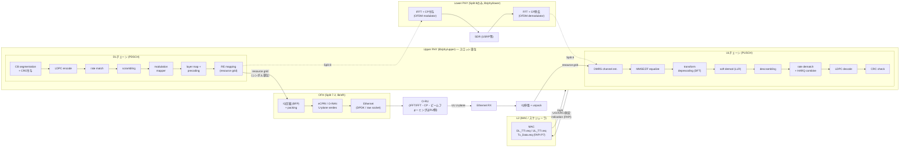
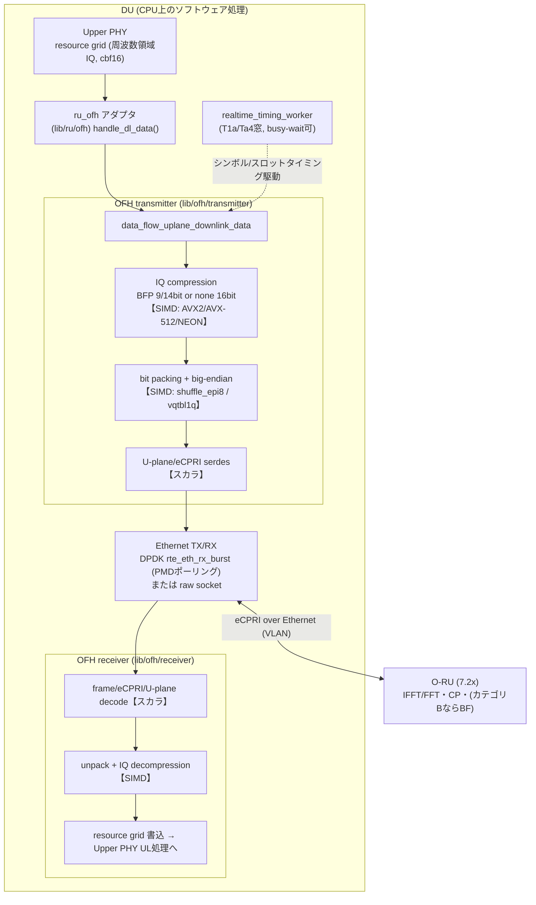
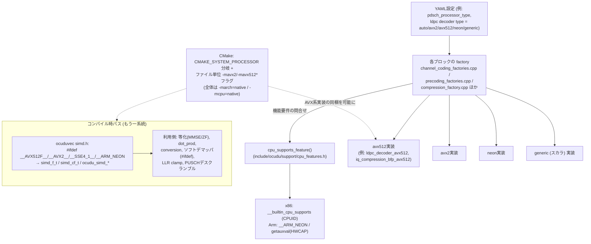

# OCUDU L1処理 技術解説 — CPU実行とSIMD活用

| 項目 | 内容 |
|---|---|
| 調査対象 | OCUDU(Linux Foundation 配下のオープンソース 5G CU/DU スタック) |
| 対象バージョン | v26.04.0(`cmake/modules/version.cmake:5-7`)/ C++17(`CMakeLists.txt:18`) |
| 調査方法 | リポジトリのソースコード・ビルド定義・CI 定義の静的調査(全主張に file:行 を併記) |
| 作成日 | 2026-06-10 |

> 凡例:本書の記述は原則としてリポジトリ内の実コードを根拠とし、`ファイルパス:行番号` を括弧で併記する(パスはリポジトリルート相対)。コードで確認できない一般的背景知識には「**※一般論**」、確認できなかった事項には「**未確認(要確認)**」と明記する。

---

## 目次

- [A. 概要(エグゼクティブサマリ)](#a-概要エグゼクティブサマリ)
- [B. L1処理の詳細](#b-l1処理の詳細)
  - [B-1. スロット/シンボル単位の処理パイプライン全体像](#b-1-スロットシンボル単位の処理パイプライン全体像)
  - [B-2. DL処理チェーン](#b-2-dl処理チェーン)
  - [B-3. UL処理チェーン](#b-3-ul処理チェーン)
  - [B-4. CPU実行モデル](#b-4-cpu実行モデル)
- [C. SIMDライブラリの使用箇所マップ【最重要】](#c-simdライブラリの使用箇所マップ最重要)
  - [C-0. 処理ブロック×SIMD使用 対応表(総括)](#c-0-処理ブロックsimd使用-対応表総括)
  - [C-1. FEC(最優先)](#c-1-fec最優先)
  - [C-2. その他のDSP処理](#c-2-その他のdsp処理)
  - [C-3. フロントホール / Low-PHY(最優先級)](#c-3-フロントホール--low-phy最優先級)
- [D. マルチCPUアーキテクチャ対応](#d-マルチcpuアーキテクチャ対応)
- [E. インターフェースと周辺](#e-インターフェースと周辺)
- [F. まとめ・所見](#f-まとめ所見)

---

## A. 概要(エグゼクティブサマリ)

### A-1. OCUDU L1の位置づけ

OCUDU は 3GPP / O-RAN Alliance 仕様に準拠した CU/DU のフルスタック実装であり、L1/L2/L3 を最小限の外部依存で含む(`README.md`)。本書が対象とする L1(PHY)は `lib/phy` に実装され、以下のレイヤ構成を持つ。

- **Upper PHY**(`lib/phy/upper`):チャネル符号化(LDPC/Polar/CRC)、変調・復調、チャネル推定・等化、PDSCH/PUSCH/PUCCH/PRACH/SRS の各チャネルプロセッサ
- **Lower PHY**(`lib/phy/lower`):OFDM 変復調(IFFT/FFT・CP 付与除去)、PRACH 復調、振幅制御(Split 8 = SDR 構成時に使用)
- **汎用関数**(`lib/phy/generic_functions`):DFT/FFT、プリコーディング、transform precoding
- **ベクトル演算ライブラリ**(`lib/ocuduvec` / `include/ocudu/ocuduvec`):L1 全域から使われる SIMD 抽象化層
- **Open Fronthaul**(`lib/ofh`):O-RAN 7.2x スプリットの M/C/U-plane 送受信、IQ 圧縮・伸張、eCPRI、Ethernet(DPDK / raw socket)

L2(MAC/スケジューラ)との境界は SCF FAPI(P5/P7)であり(`include/ocudu/fapi`、SCF-222 v4.0/v8.0 参照。E 節参照)、無線側の境界は RU 抽象化(`lib/ru`:`ru_ofh` = 7.2x、`ru_sdr` = Split 8、`ru_dummy`)である。

### A-2. 「CPUソフトウェアL1」であることの意義(要約)

OCUDU の L1 は**専用 DSP / FPGA を必須とせず、汎用 CPU 上の C++ ソフトウェアとして全処理を実行できる**。リアルタイム性能は次の 3 本柱で確保される。

1. **SIMD ベクトル化**:処理量が支配的なブロック(LDPC 復号、レートデマッチ、変調/復調、プリコーディング、フロントホール IQ 圧縮)に対し、x86(SSE4.1/AVX2/AVX-512)と Arm(NEON)それぞれの手書き intrinsic 実装を用意し、起動時に CPU 機能を検出して最速実装を選択する(`include/ocudu/support/cpu_features.h:94-132`、各 `*_factories.cpp`)。
2. **リアルタイム実行モデル**:`SCHED_FIFO/RR` によるリアルタイム優先度、`pthread_setaffinity_np` によるコアピンニング、優先度別タスクエグゼキュータによるスロット締切駆動の並列処理(`lib/support/executors/unique_thread.cpp:16-59`、`lib/du/du_low/du_low_executor_mapper.cpp:65-121`)。
3. **オプションのオフロード/高速 I/O**:DPDK による fronthaul NIC ポーリング(`lib/ofh/ethernet/dpdk/dpdk_ethernet_receiver.cpp:91`)、DPDK bbdev 経由の LDPC ハードウェアアクセラレーション(Intel ACC100 系、`lib/hal/dpdk/bbdev`。ただしエンタープライズビルドゲートあり。E 節参照)。

対応 CPU アーキテクチャは **x86_64 と aarch64 の 2 系統**で、CMake が `CMAKE_SYSTEM_PROCESSOR` で分岐し(例 `lib/phy/upper/channel_coding/ldpc/CMakeLists.txt:19-37`)、CI も amd64/arm64 の両ランナーで検証される(`.gitlab/ci/builders/.gitlab-ci.yml`)。SIMD 非対応環境向けにはすべての高速化ブロックにスカラ(generic)フォールバックが存在する。Arm SVE/SVE2 と RISC-V Vector は**未対応**(リポジトリ全体に `arm_sve.h` / SVE 関連コードが存在しないことを確認)。

### A-3. SIMD活用の全体像(要約)

- SIMD は 2 階層で使われる:(1) `include/ocudu/ocuduvec/simd.h`(2,802 行)の**共通ベクタ型・共通 API**(`simd_f_t` / `simd_cf_t` / `ocudu_simd_*` 関数群)をコンパイル時に各 ISA へマップする層、(2) LDPC・変調・OFH 圧縮など**ブロック専用の手書き intrinsic 実装**(`*_avx2.cpp` / `*_avx512*.cpp` / `*_neon.cpp`)。
- ブロック専用実装は**ファクトリ+ランタイム CPU 検出**(`cpu_supports_feature()`)で選択され、`ocuduvec` 層は**コンパイル時マクロ**(`__AVX512F__` / `__AVX2__` / `__SSE4_1__` / `__ARM_NEON`)で固定される(D 節参照)。
- FEC では LDPC デコーダ/レートデマッチが最重量級の SIMD 実装(AVX-512 マスクレジスタ・VBMI まで使用)。CRC は x86 PCLMULQDQ / Arm PMULL のキャリーレス乗算実装を持つ。Polar(PDCCH/PBCH)はスカラのみ。
- フロントホールでは BFP 圧縮・伸張と 9/14/16 bit ビットパッキングが AVX2/AVX-512/NEON でフル実装。μ-law・block scaling・modulation compression は**未実装スタブ**(`lib/ofh/compression/compression_factory.cpp:76-86`)。

---

## B. L1処理の詳細

### B-1. スロット/シンボル単位の処理パイプライン全体像

L2(MAC)は FAPI のスロットメッセージ(DL_TTI.request / UL_TTI.request / UL_DCI.request / Tx_Data.request)で L1 を駆動し、Upper PHY が**スロット単位**でリソースグリッドを生成・消費する(`include/ocudu/fapi/p7/messages/dl_tti_request.h:22-25`、`lib/fapi_adaptor/mac/p7/`)。7.2x スプリット(`ru_ofh`)では、リソースグリッド(周波数領域 IQ)が**シンボル単位**で OFH 送信機へ渡され、IQ 圧縮・eCPRI/Ethernet 化されて RU へ送られる。IFFT/CP 付与等の時間領域処理は RU 側であり、DU の lower PHY はバイパスされる(`apps/units/flexible_o_du/split_7_2/`、`lib/ru/ofh/ru_ofh_downlink_plane_handler_proxy.h:22-38`)。Split 8(`ru_sdr`)では DU 内の lower PHY が IFFT/FFT・CP を実行し、UHD 経由で SDR にベースバンドを渡す(`lib/phy/lower/modulation/`、`apps/units/flexible_o_du/split_8/`)。

**図1: L1処理パイプライン(DL/UL)**



### B-2. DL処理チェーン

**PDSCH**(`lib/phy/upper/channel_processors/pdsch/`):`pdsch_processor_flexible_impl`(`pdsch_processor_flexible_impl.cpp`)がスロット内処理を統括し、以下を実行する。

1. **コードブロックセグメンテーション + CRC 付与**:TS38.212 §5.2.1。`ldpc_segmenter_tx_impl`(`lib/phy/upper/channel_coding/ldpc/ldpc_segmenter_tx_impl.cpp`)。CRC16/CRC24A/CRC24B は `crc_calculator`(C-1 参照)。
2. **LDPC エンコード**:`ldpc_encoder_{generic,avx2,neon}`(`lib/phy/upper/channel_coding/ldpc/ldpc_encoder_avx2.cpp` ほか)。
3. **レートマッチ**:ビット選択+インターリーブ。`ldpc_rate_matcher_impl`(`ldpc_rate_matcher_impl.cpp`、TS38.212 §5.4.2)。
4. **スクランブル**:Gold 系列 `pseudo_random_generator_impl`(`lib/phy/upper/sequence_generators/pseudo_random_generator_impl.cpp`)。
5. **変調マッピング**:QPSK〜256QAM。`modulation_mapper_{lut,avx512,neon}_impl`(`lib/phy/upper/channel_modulation/`)。
6. **レイヤマッピング+プリコーディング+RE マッピング**:`resource_grid_mapper_impl`(`lib/phy/support/resource_grid_mapper_impl.h:14-59`)が `channel_precoder_{generic,avx2,avx512,neon}`(`lib/phy/generic_functions/precoding/`)を呼び出してアンテナポートへ複素 MAC を適用。
7. (Split 8 のみ)**IFFT + CP 付与**:`ofdm_modulator_impl`(`lib/phy/lower/modulation/ofdm_modulator_impl.h:20-65`)が DFT プロセッサ(FFTW 等)を用いる。

**SSB/PDCCH**:PBCH/PDCCH のチャネル符号化は **Polar**(エンコーダ `polar_encoder_impl.cpp`、レートマッチ・インターリーバ・アロケータ含む。`lib/phy/upper/channel_coding/polar/`)。PDCCH/SSB の各プロセッサは `lib/phy/upper/channel_processors/{pdcch,ssb}` に実装される。Polar 系は全てスカラ実装(C-1 参照)。

### B-3. UL処理チェーン

**PUSCH**(`lib/phy/upper/channel_processors/pusch/`):

1. **(Split 8 のみ)FFT + CP 除去**:`ofdm_demodulator_impl`(`lib/phy/lower/modulation/`)。7.2x では RU 側。
2. **DMRS チャネル推定**:`port_channel_estimator_average_impl` + ヘルパ(`lib/phy/upper/signal_processors/channel_estimator/port_channel_estimator_helpers.cpp`)。パイロット抽出・cbf16→cf 変換に AVX2/NEON 直書き、相関・電力計算は `ocuduvec::dot_prod` / `average_power` 経由で SIMD(C-2 参照)。時間軸アライメント推定は DFT ベース。
3. **等化(MMSE/ZF)**:`channel_equalizer_generic_impl` が次元別テンプレート(1xN/2xN 特化+一般 MxN SIMD 版)へ分岐。一般版は Gram 行列構築→逆行列→等化を `simd_cf_t` 上で実行(`lib/phy/upper/equalization/equalize_mmse_mxn_simd.h:14-75`)。
4. **transform deprecoding(DFT-s-OFDM 時)**:`transform_precoder_dft_impl`(`lib/phy/generic_functions/transform_precoding/transform_precoder_dft_impl.h:14-51`)が DFT プロセッサへ委譲。
5. **ソフト復調(LLR 算出)**:`demodulation_mapper_qpsk/qam16/qam64/qam256.cpp`(AVX2/NEON 実装内蔵)。
6. **デスクランブル**:PUSCH デマッパ内で LLR 系列に Gold 系列を適用(AVX-512/AVX2/NEON。`lib/phy/upper/channel_processors/pusch/pusch_demodulator_impl.cpp:43-191`)。
7. **レートデマッチ + HARQ ソフト合成**:`ldpc_rate_dematcher_{impl,avx2,avx512,neon}_impl`(飽和加算でソフトビット合成)。
8. **LDPC デコード**:`ldpc_decoder_{generic,avx2,avx512,neon}`(layered min-sum。C-1 参照)→ **CRC チェック**。

**PUCCH**:F0/F1 は系列相関ベース、F2 は復調+ショートブロック/Polar 復号(`lib/phy/upper/channel_processors/pucch/`)。F2 の RE 抽出は AVX2 gather / NEON 実装(`pucch_demodulator_format2.cpp:33-46`)。UCI 小ビット数は最尤検出のショートブロックデコーダ(`lib/phy/upper/channel_coding/short/short_block_detector_impl.h:38-44`)。

**PRACH**:lower PHY の `ofdm_prach_demodulator_impl`(Split 8)または OFH 経由の PRACH U-plane 受信(7.2x)で周波数領域系列を取得し、`prach_detector_generic_impl`(`lib/phy/upper/channel_processors/prach/prach_detector_generic_impl.h:23-92`)が Zadoff-Chu 系列との相関(IDFT は DFT プロセッサ委譲)とノイズ推定でプリアンブル検出を行う。

### B-4. CPU実行モデル

- **タスクエグゼキュータ分割**:Upper PHY の処理種別ごとに専用エグゼキュータを設定可能(`include/ocudu/phy/upper/upper_phy_execution_configuration.h:31-58`:`pdsch_executor`、`pusch_executor`、`pusch_decoder_executor`、`pucch_executor` 等、各 `max_concurrency` 付き)。
- **優先度 3 層モデル**:`du_low_executor_mapper` は単一エグゼキュータモード(`lib/du/du_low/du_low_executor_mapper.cpp:65-85`)と flexible モード(同 `:87-121`)を持ち、後者は (1) RT 高優先(PDCCH/PDSCH/SSB/CSI-RS/PRS)、(2) 非 RT 高優先(DL グリッド/PRACH/PUCCH)、(3) 非 RT 中優先(PUSCH/SRS/PUSCH デコーダ/チャネル推定)に振り分ける。並列度は `task_fork_limiter`(`include/ocudu/support/executors/task_fork_limiter.h`)と `max_pdsch_concurrency` / `max_pusch_and_srs_concurrency` / `max_pucch_concurrency`(`include/ocudu/du/du_low/du_low_executor_mapper.h:59-86`)で制御される(HW アクセラレータ容量との整合もこのパラメータで取る)。
- **リアルタイムスケジューリングとコアピンニング**:スレッド生成時に `pthread_setschedparam()` で `SCHED_FIFO`/`SCHED_RR` を設定し(`lib/support/executors/unique_thread.cpp:16-29,106-110`)、`pthread_setaffinity_np()` + `CPU_SET_S()` でコアへピン留めする(同 `:31-59`)。アプリ層のワーカマネージャは DU low / RU 向けスレッドプロファイル(`sequential`/`single`/`dual`/`triple`)と OFH タイミング・TxRx ワーカの affinity 設定を持つ(`apps/services/worker_manager/worker_manager_config.h:17-60`)。
- **タイミングバジェット**:OFH セクタ設定に `max_processing_delay_slots`、`dl_processing_time`、`ul_processing_time`(µs)を持ち(`include/ocudu/ofh/ofh_sector_config.h:101-108`)、送信窓は T1a 系(`include/ocudu/ofh/transmitter/ofh_transmitter_timing_parameters.h:13-33`)、受信窓は Ta4 系(`include/ocudu/ofh/receiver/ofh_receiver_timing_parameters.h:13-20`)の O-RAN タイミングパラメータで規定される。
- **ポーリング**:OFH タイミングワーカは `enable_busy_waiting` フラグでビジーウェイト/スリープを切替(`lib/ofh/timing/realtime_timing_worker.h:23-36`、`realtime_timing_worker.cpp:140,153`)。Ethernet I/O は DPDK PMD ポーリング(`rte_eth_rx_burst`、`lib/ofh/ethernet/dpdk/dpdk_ethernet_receiver.cpp:91`)または raw socket を選択(`include/ocudu/ofh/ofh_sector_config.h:112-113` の `uses_dpdk`)。
- **メトリクス**:エグゼキュータ単位のレイテンシ/CPU 負荷(`include/ocudu/support/executors/metrics/executor_metrics.h:12-32`)、PDSCH/PUSCH/LDPC の処理時間アグリゲータ(`lib/phy/upper/metrics/aggregators/`)、OFH の遅延着信検出(`lib/ofh/timing/ofh_timing_metrics_collector_impl.h`)。

---

## C. SIMDライブラリの使用箇所マップ【最重要】

### C-0. 処理ブロック×SIMD使用 対応表(総括)

判定基準:**有** = 当該ブロック専用の SIMD intrinsic 実装あり/**有(ocuduvec)** = 共通ベクタ API 経由で SIMD 化/**間接** = 内部で呼ぶ別ブロック(DFT 等)が SIMD/**無** = スカラのみ/**未実装** = 機能自体が存在しない。

| # | 処理ブロック | 分類 | SIMD使用 | 使用intrinsic / 抽象化API | 根拠(file:行 / 関数) | 対応アーキ | スカラfallback |
|---|---|---|---|---|---|---|---|
| 1 | LDPCデコーダ(layered min-sum) | FEC | **有** | `_mm256_subs_epi8/_min_epi8/_blendv_epi8`、`_mm512_*_mask`+`_kandn_mask64`、`vqsubq_s8/vminq_s8/vbslq_s8` | `ldpc_decoder_avx2.cpp:78-129` / `ldpc_decoder_avx512.cpp:93-249` / `ldpc_decoder_neon.cpp:76-89` | AVX2 / AVX-512(F,BW) / NEON | 有(`ldpc_decoder_generic.cpp`) |
| 2 | LDPCエンコーダ | FEC | **有** | `mm256::avx2_span` 経由のXOR/回転、NEON同等(`neon_span`) | `ldpc_encoder_avx2.cpp:17` / `ldpc_encoder_neon.cpp:17,72-75` | AVX2 / NEON(AVX-512版なし) | 有(`ldpc_encoder_generic.cpp`) |
| 3 | LDPCレートマッチ(DL: ビット選択+インターリーブ) | FEC | **無** | — | `ldpc_rate_matcher_impl.cpp`(TS38.212 §5.4.2) | — | スカラのみ |
| 4 | LDPCレートデマッチ(UL: デインターリーブ+HARQ合成) | FEC | **有** | `_mm256_adds_epi8`、`_mm512_permutex2var_epi8`(**VBMI**)、`_mm512_mask_blend_epi8` | `ldpc_rate_dematcher_avx2_impl.cpp:31,48-66` / `ldpc_rate_dematcher_avx512_impl.cpp:31-37,99-112` / `ldpc_rate_dematcher_neon_impl.cpp` | AVX2 / AVX-512(F,BW,VBMI) / NEON | 有(`ldpc_rate_dematcher_impl.cpp`) |
| 5 | CRC生成/チェック | FEC | **有** | `_mm_clmulepi64_si128`(**PCLMULQDQ**)+`_mm_shuffle_epi8`、`vmull_p64`(**PMULL**) | `crc_calculator_clmul_impl.cpp:52-65,85` / `crc_calculator_neon_impl.cpp:78-100` | x86(CLMUL+SSE4.1) / Arm(PMULL) | 有(LUT版 `crc_calculator_lut_impl.cpp`、generic版) |
| 6 | コードブロックセグメンテーション | FEC | **無** | —(内部のCRCは#5でSIMD) | `ldpc_segmenter_tx_impl.cpp` / `ldpc_segmenter_rx_impl.cpp` | — | スカラのみ |
| 7 | Polar符号(PDCCH/PBCH)エンコード/デコード | FEC | **無** | —(復号はSSC: simplified successive cancellation) | `polar_decoder_impl.h:21-29` / `polar_encoder_impl.cpp` ほか `lib/phy/upper/channel_coding/polar/` | — | スカラのみ |
| 8 | ショートブロック符号(UCI ≤11bit)符号化/検出 | FEC | **無** | —(最尤検出+基底系列LUT) | `short_block_encoder_impl.cpp:17-28` / `short_block_detector_impl.h:38-44` | — | スカラのみ |
| 9 | 変調マッパ(QPSK〜256QAM) | DSP | **有** | `_mm512_permutex2var_epi8`、`_mm512_mask_blend_epi8`、`vqtbl/vbslq_s8/vst2q_s8` | `modulation_mapper_avx512_impl.cpp:20-61` / `modulation_mapper_neon_impl.cpp:43-168` | AVX-512(F,BW,VBMI) / NEON | 有(LUT版 `modulation_mapper_lut_impl.cpp:60-111`) |
| 10 | ソフトデマッパ(LLR算出) | DSP | **有** | `_mm256_loadu_ps`、`mm256::safe_div`、`_mm256_permute2f128_ps`、NEON同等 | `demodulation_mapper_qam16.cpp:24-104(#ifdef __AVX2__),105-216(#ifdef __ARM_NEON)`、同様に `qpsk.cpp:20-`, `qam64.cpp:167-`, `qam256.cpp:193-` | AVX2 / NEON(コンパイル時切替) | 有(interval LUT スカラ) |
| 11 | LLR後処理(クランプ・ハード判定パック) | DSP | **有** | `_mm512_mask_blend_epi8`+`_mm512_mask_storeu_epi8`、`_mm256_movemask_epi8`、NEON | `log_likelihood_ratio.cpp:115-160(AVX2),213-232(NEON),262-314(AVX-512/AVX2/NEON clamp)` | AVX2 / AVX-512 / NEON | 有 |
| 12 | スクランブル/デスクランブル(Gold系列適用) | DSP | **有** | PUSCH: `_mm512_movm_epi8`+`_mm512_xor_si512`、`_mm256_shuffle_epi8`、`veorq_s8`;ビット展開: `ocuduvec/bit.cpp` | `pusch_demodulator_impl.cpp:43-71(AVX-512),83-117(AVX2),188-191(NEON)` / `pseudo_random_generator_impl.cpp:13-17` / `lib/ocuduvec/bit.cpp:68-139` | AVX2 / AVX-512 / NEON | 有(`bit.cpp:141-156` ほか) |
| 13 | チャネル推定(DMRS抽出・補間・相関) | DSP | **有(部分)+ocuduvec** | パイロット抽出/cbf16→cf: `_mm256_shuffle_epi8`、`vzip1q_u16`;相関/電力: `ocuduvec::dot_prod` | `port_channel_estimator_helpers.cpp:383-436(AVX2),438-493(NEON)` / `lib/ocuduvec/dot_prod.cpp:18-26` | AVX2 / NEON + simd.h全アーキ | 有 |
| 14 | 等化(ZF/MMSE、1x1〜4x4 Gram行列+逆行列) | DSP | **有(ocuduvec)** | `ocudu_simd_cf_conjprod`、`ocudu_simd_f_precise_rcp`(Newton-Raphson)、`ocudu_simd_cf_select` | `equalize_zf_mxn_simd.h:14-58` / `equalize_mmse_mxn_simd.h:14-75` / `channel_equalizer_generic_impl.cpp` | SSE4.1 / AVX2 / AVX-512 / NEON(simd.h) | 有(1xN/2xN特化版) |
| 15 | FFT/IFFT(DFT) | DSP | **有(外部lib+自前AVX2)** | FFTW3(float)を既定とし内部でSIMD化(※FFTW内部実装)。ci16入出力用の自前AVX2 DFTあり | `dft_processor_fftw_impl.cpp` / `dft_processor_ci16_avx2.cpp:6` / 選択: `generic_functions_factories.cpp:107-143` | FFTW: x86/Arm両対応、ci16: AVX2のみ | 有(`dft_processor_generic_impl`) |
| 16 | transform precoding(DFT-s-OFDM) | DSP | **間接** | DFTプロセッサへ委譲 | `transform_precoder_dft_impl.h:14-51` | DFT実装に依存 | 有 |
| 17 | プリコーディング/レイヤマッピング | DSP | **有** | `_mm256_fmaddsub_ps`(複素MAC)、`_mm512` 同等、`vmlaq_f32/vmlsq_f32`+`vld2q_f32` | `channel_precoder_avx2.cpp:39,84-98` / `channel_precoder_avx512.cpp` / `channel_precoder_neon.cpp:48-49,108-122` | AVX2+FMA / AVX-512(F,BW) / NEON | 有(`channel_precoder_generic`) |
| 18 | REマッピング(resource grid mapper) | DSP | **間接** | プリコーダ(#17)+ocuduvec経由 | `resource_grid_mapper_impl.h:14-59` | #17に依存 | 有 |
| 19 | PRACH相関・検出 | DSP | **間接** | 相関ループはスカラ、IDFT/電力計算はDFTプロセッサ+ocuduvec | `prach_detector_generic_impl.h:41-66` | — | スカラ |
| 20 | PUCCH F2 復調(RE抽出) | DSP | **有** | `_mm256_i32gather_epi32`、NEON | `pucch_demodulator_format2.cpp:33-46` | AVX2 / NEON | 有 |
| 21 | 測定系(RSRP/EPRE/SINR/雑音分散: dot product・sum-of-squares) | DSP | **有(ocuduvec)** | `ocudu_simd_cf_conjprod`、`ocudu_simd_cf_norm_sq`、`ocudu_simd_f_hadd` | `lib/ocuduvec/dot_prod.cpp:18-100` / `modulus_square.cpp:14-27` | SSE4.1 / AVX2 / AVX-512 / NEON | 有(末尾remainderループ) |
| 22 | MIMO検出・レイヤ分離 / MRC | DSP | (線形等化に包含) | 非線形検出器(sphere/ML)は存在しない。1xN等化がMRC相当 | `lib/phy/upper/equalization/`(#14) | #14と同じ | — |
| 23 | OFDM変復調(CP付与/除去・位相補償)※Split 8 | DSP | **間接+ocuduvec** | DFT委譲+`sc_prod`等。CP操作・位相補償LUTはスカラ | `ofdm_modulator_impl.h:20-65` / `lib/phy/lower/modulation/` | DFT実装に依存 | 有 |
| 24 | 振幅制御/クリッピング(lower PHY) | DSP | **無**(クリップ本体) | `ocuduvec::clip*` はスカラループ | `lib/ocuduvec/clip.cpp:9-58` / `amplitude_controller_clipping_impl.h:15-49` | — | スカラのみ |
| 25 | IQフォーマット変換(int16↔float、bf16↔float) | DSP/FH | **有** | `ocudu_simd_convert_2f_s`、`_mm512_cvtepi16_epi32`+`_mm512_cvtepi32_ps`、`vcvt_f32_bf16` | `lib/ocuduvec/conversion.cpp:10-46(fi),48-111(if),128-157(bf16)` | AVX2 / AVX-512 / SSE4.1 / NEON | 有 |
| 26 | IQ圧縮: BFP(Block Floating Point) | FH | **有** | 指数算出 `mm512::determine_bfp_exponent`、`_mm256_srai_epi16`、`_mm512_maskz_loadu_epi16`、`vld1q_s16_x3`+`vshlq_s16` | `iq_compression_bfp_avx2.cpp:56-72` / `iq_compression_bfp_avx512.cpp:100-139` / `iq_compression_bfp_neon.cpp:94-95` | AVX2 / AVX-512(F,VL,BW,DQ,CD) / NEON | 有(`iq_compression_bfp_impl.cpp`) |
| 27 | IQ伸張: BFP | FH | **有** | `unpack_prb_big_endian`(shuffle系)、`_mm256_srai_epi16`+`_mm256_or_si256` | `iq_compression_bfp_avx2.cpp:84-125,288-289` / `iq_compression_bfp_avx512.cpp:147-202` / `iq_compression_bfp_neon.cpp:201-250` | 同上 | 有 |
| 28 | IQ非圧縮(16bit)+スケーリング | FH | **有** | パッキング/BE変換(#29と共通) | `iq_compression_none_avx2.cpp:59-65` / `_avx512.cpp` / `_neon.cpp` | AVX2 / AVX-512 / NEON | 有(`iq_compression_none_impl.cpp`) |
| 29 | IQビットパッキング/アンパッキング(9/14/16bit, big-endian) | FH | **有** | `_mm256_sllv_epi32`+`_mm256_shuffle_epi8`、`_mm512_sllv_epi16`+`_mm_mask_storeu_epi8`、`vqtbl1q_s8`(テーブルシャッフル=vpshufb相当) | `packing_utils_avx2.h:23-60,169-201,345-348` / `packing_utils_avx512.h:37-50` / `packing_utils_neon.h:19-49` | AVX2(9/16bit のみ) / AVX-512(9/14/16bit) / NEON(9/14/16bit) | 有(generic実装) |
| 30 | IQ圧縮: μ-law / block scaling / modulation compression / selective系 | FH | **未実装** | ファクトリが `iq_compression_death_impl`(エラー実装)を返す | `compression_factory.cpp:76-86` | — | — |
| 31 | eCPRIメッセージ生成/解析 | FH | **無** | `htons`+`memcpy`(スカラ直列化) | `ecpri_packet_builder_impl.cpp` / `network_order_binary_serializer.h:15-92` | — | スカラのみ |
| 32 | O-RAN U/C-plane serdes(セクションヘッダ等) | FH | **無** | ビットフィールド演算 | `ofh_uplane_message_builder_impl.cpp:40-105` / `ofh_cplane_message_builder_impl.cpp` | — | スカラのみ |
| 33 | Ethernet/VLAN 送受信 | FH | **委譲(DPDK)** | `rte_eth_rx_burst` / `rte_vlan_strip`(DPDK内部のベクトル化PMD ※一般論) | `dpdk_ethernet_receiver.cpp:91,109` | DPDK対応アーキ | raw socket版あり |
| 34 | ビームフォーミング重み適用(FH層) | FH | **該当なし** | OFH層に重み適用処理は存在しない(eAxCはルーティングID)。プリコーディングはupper PHY(#17)で実施し、カテゴリA RU相当の運用 | `ofh_transmitter_factories.cpp`(dl_eaxc) | — | — |
| 35 | CP付与/除去・windowing(FH文脈) | FH | **該当なし** | 7.2xではRU側機能。DU側コードに存在しない(Split 8では#23) | — | — | — |

### C-1. FEC(最優先)

#### LDPCデコーダ — リポジトリ中で最も重い SIMD 実装

- アルゴリズムは **layered min-sum**(変数→チェックメッセージの最小値・第2最小値を追跡:`ldpc_decoder_impl.cpp:85-98`、符号積の追跡:`ldpc_decoder_avx2.cpp:113-115`)。LLR は int8 で保持され、1 レジスタで AVX2=32 / AVX-512=64 / NEON=16 LLR を並列処理する(`simd_support.h:19-24` の `AVX2_SIZE_BYTE=32` 等)。
- AVX-512 版は**マスクレジスタを本格活用**:`_mm512_cmpgt_epi8_mask` / `_mm512_mask_blend_epi8` / `_kandn_mask64` / `_kor_mask64`(`ldpc_decoder_avx512.cpp:101-150,237-249`)。
- 実装選択は `create_ldpc_decoder_factory_sw()` → `"auto"` 時に `cpu_supports_feature(avx512f && avx512bw)` → AVX-512、`avx2` → AVX2、(aarch64)`neon` → NEON、いずれも不可なら generic(`channel_coding_factories.cpp:96-120`)。
- ラッパ層:`simd_span<simdWrapper>` テンプレート(`simd_support.h:32-191`)+ `mm256::avx2_span` / `mm512::avx512_span` / `neon::neon_span`(`avx2_support.h:37-38` ほか)。LLR スケーリング用の固有ヘルパ `mm256::scale_epi8` / `mm512::scale_epi8` / `neon::scale_s8`(`avx2_support.h:47-88` ほか)。

#### LDPCエンコーダ

- AVX2 / NEON のみ(**AVX-512 版エンコーダは存在しない** — `lib/phy/upper/channel_coding/ldpc/` のファイル一覧で確認)。リフティングサイズ・BG 別の戦略テンプレートで高レート領域を符号化(`ldpc_encoder_avx2.cpp:17`、`ldpc_encoder_neon.cpp:17,72-75`)。選択は `channel_coding_factories.cpp:131-151`。

#### レートマッチ / デマッチ

- **DL(レートマッチ)はスカラのみ**(`ldpc_rate_matcher_impl.cpp`)。
- **UL(レートデマッチ)は SIMD 重実装**:ソフトビットの飽和加算(HARQ 合成)`_mm256_adds_epi8` / `_mm512_adds_epi8`、デインターリーブに **AVX-512 VBMI の `_mm512_permutex2var_epi8`**(バイト粒度 2 ソース置換)を使用(`ldpc_rate_dematcher_avx512_impl.cpp:99-112`)。ファクトリは avx512f+bw+**vbmi** を要求(`channel_coding_factories.cpp:162-189`)。

#### CRC — キャリーレス乗算

- x86: `_mm_clmulepi64_si128`(PCLMULQDQ)による folding 実装。`crc32_folding_round()`(`crc_calculator_clmul_impl.cpp:52-57`):

  ```c
  __m128i tmp = _mm_clmulepi64_si128(fold, k1_k2, 0x11);
  return _mm_xor_si128(_mm_clmulepi64_si128(fold, k1_k2, 0x00), _mm_xor_si128(data_block, tmp));
  ```

- Arm: `vmull_p64`(PMULL)実装(`crc_calculator_neon_impl.cpp:78-100`)。PMULL の有無は `getauxval(AT_HWCAP) & HWCAP_PMULL` でランタイム判定(`cpu_features.h:127`)。
- 選択:CRC6 は常に generic、x86 は pclmul+sse4_1 で CLMUL 版、aarch64 は neon+pmull で NEON 版、それ以外は LUT/generic(`channel_coding_factories.cpp:50-78`)。

#### Polar / セグメンテーション / ショートブロック

- Polar 復号は **SSC(simplified successive cancellation)**で SCL ではない(`polar_decoder_impl.h:21-29` の rate-0/rate-1/rate-R ノード分類)。エンコーダ・インターリーバ・アロケータ含め**全てスカラ**。PDCCH/PBCH はデータチャネル比で処理量が小さいことが背景と考えられる(**※一般論**)。
- セグメンテーション(`ldpc_segmenter_tx/rx_impl.cpp`)、ショートブロック(`short_block_*_impl.cpp`)もスカラのみ。

### C-2. その他のDSP処理

#### 変調マッパ / ソフトデマッパ

- **変調マッパ**は AVX-512(64 シンボル/バッチ、`_mm512_permutex2var_epi8` による複素インターリーブ:`modulation_mapper_avx512_impl.cpp:56-57`)と NEON(`modulation_mapper_neon_impl.cpp:43-168`)。x86 で AVX-512 が無い場合は LUT スカラ版(AVX2 専用版は無い)。選択はランタイム検出(`channel_modulation_factories.cpp:25-40`)。
- **ソフトデマッパ(LLR 算出)**は QPSK/16/64/256QAM 各ファイル内に `#ifdef __AVX2__` / `#ifdef __ARM_NEON` の**コンパイル時切替**で SIMD パスを内蔵(例:`demodulation_mapper_qam16.cpp:24-104` の AVX2 パスは `_mm256_loadu_ps`、`mm256::safe_div` によるノイズ分散逆数、`_mm256_permute2f128_ps` 系の並べ替えを使用)。AVX-512 版は無い。
- **LLR 型共通処理**:`log_likelihood_ratio.cpp` にクランプ(AVX-512 `_mm512_mask_blend_epi8`:`:262-285`、AVX2:`:291-303`、NEON:`:314-`)とハード判定のビットパック(AVX2 `_mm256_movemask_epi8`:`:115-160`、NEON:`:213-232`)。

#### スクランブル/デスクランブル(Gold 系列)

- 系列生成(LFSR x1/x2)はスカラだが、**適用側が SIMD**:PUSCH デマッパは LLR への XOR / 符号反転を AVX-512(`_mm512_movm_epi8` でビット列→バイトマスク展開後 `_mm512_xor_si512`:`pusch_demodulator_impl.cpp:43-71`)、AVX2(`:83-117`)、NEON(`veorq_s8`:`:188-191`)で実装。ビット⇄バイト展開は `ocuduvec/bit.cpp:68-139`(AVX-512 64bit/iter、AVX2 32bit/iter)。

#### チャネル推定・等化

- チャネル推定は、リソースグリッドからの DMRS パイロット抽出と cbf16→cf 変換に専用 AVX2/NEON コード(`port_channel_estimator_helpers.cpp:383-436,438-493`)。相関・ノイズ/EPRE/SINR 推定は `ocuduvec` の `dot_prod` / `average_power`(SIMD)を利用。
- 等化は MxN(最大 4x4)の Gram 行列+逆行列+等化を `simd_cf_t` ベクトル上で同時複数 RE 処理する設計(`equalize_mmse_mxn_simd.h:14-75`、ノイズ項追加 `:34`、逆数は Newton-Raphson 精緻化 `ocudu_simd_f_precise_rcp`:`:63`)。非線形 MIMO 検出器(sphere 等)は存在しない。

#### FFT/IFFT・transform precoding

- DFT は外部ライブラリ優先:**FFTW3**(`dft_processor_fftw_impl.cpp`、plan 最適化レベル ESTIMATE/MEASURE/EXHAUSTIVE:`dft_processor_fftw_impl.h:19-26`)→ FFTZ(AMD AOCL)→ generic の順で選択(`generic_functions_factories.cpp:107-143`)。CMake オプションで Intel MKL(FFTW3 互換 I/F)、ARM Performance Libraries も選択可能(`CMakeLists.txt:376-429`)。FFTW 等の内部 SIMD 化はライブラリ実装による(**※一般論**)。
- 16bit 複素整数(ci16)入出力用の**自前 AVX2 DFT** `dft_processor_ci16_avx2` あり(`dft_processor_ci16_avx2.cpp`、選択時に `cpu_supports_feature(avx2)` を確認:`generic_functions_factories.cpp:137`)。
- PUSCH の transform precoding(DFT-s-OFDM)は DFT プロセッサ委譲(`transform_precoder_dft_impl.h:14-51`)。

#### プリコーディング/レイヤマッピング

- アンテナ間複素 MAC を AVX2(FMA 必須:`_mm256_fmaddsub_ps`+shuffle で複素乗算:`channel_precoder_avx2.cpp:39`)、AVX-512、NEON(`vmlaq_f32`/`vmlsq_f32`、出力は cbf16 への `vst1q_u16`:`channel_precoder_neon.cpp:48-49,122`)で実装。選択は `precoding_factories.cpp:26-51`(avx512f+bw → avx2+fma → neon → generic)。

#### 測定系・ocuduvec

`lib/ocuduvec` は srsvec 系譜の L1 共通ベクトル演算ライブラリで(API 一覧:`include/ocudu/ocuduvec/` の `add/accumulate/bit/clip/conversion/convolution/copy/division/dot_prod/mean/modulus_square/prod/sc_prod/subtract/unwrap/zero` 等)、主要プリミティブの SIMD 化状況は以下(全て `simd.h` の共通 API 経由で 4 ISA に展開):

| ocuduvec API | SIMD | 根拠 |
|---|---|---|
| `dot_prod`(共役内積) | 有 | `dot_prod.cpp:18-26`(`ocudu_simd_cf_conjprod`) |
| `average_power` / `modulus_square`(sum-of-squares) | 有 | `dot_prod.cpp:87-100` / `modulus_square.cpp:14-27`(`ocudu_simd_cf_norm_sq`, `ocudu_simd_f_hadd`) |
| `prod` / `sc_prod`(複素乗算・スカラ倍・位相回転 cexp) | 有 | `prod.cpp:74-103,156-200` / `sc_prod.cpp:14-143` |
| `conversion`(int16↔float, bf16↔float, cbf16↔cf) | 有 | `conversion.cpp:10-157`(AVX-512 直書きパス `:53-88` 含む) |
| `bit`(パック/アンパック) | 有 | `bit.cpp:58-156` |
| `clip` / `clip_magnitude` | 無(スカラ) | `clip.cpp:9-58` |

これらは RSRP/RSSI/SINR・雑音分散などの測定値計算(sum-of-squares 系)やチャネル推定の相関で広く呼ばれる。

### C-3. フロントホール / Low-PHY(最優先級)

#### 実装の出自

`lib/ofh` 全ファイルの著作権表示は `Copyright (C) 2021-2026 Software Radio Systems Limited`(SPDX: BSD-3-Clause-Open-MPI)であり、リポジトリ内に Intel xRAN / FlexRAN FHI への参照・派生コードは存在しない。**Intel xran/FlexRAN 由来ではなく独自実装**と判定できる(リポジトリ全域 grep で xran/FlexRAN 該当なし)。

#### IQ圧縮/伸張

- **実装済み方式は「none(16bit 非圧縮)」と「BFP」のみ**。両方式とも generic / AVX2 / AVX-512 / NEON の 4 実装を持つ(`lib/ofh/compression/iq_compression_{none,bfp}_{impl,avx2,avx512,neon}.cpp`)。
- **block scaling / μ-law / modulation compression / bfp_selective / mod_selective はファクトリが `iq_compression_death_impl`(呼び出し時エラー)を返す未実装スタブ**(`compression_factory.cpp:76-86`)。
- BFP 圧縮の SIMD 中核:ブロック指数算出(`mm512::determine_bfp_exponent`:`iq_compression_bfp_avx512.cpp:139`)、算術右シフトによる量子化(`_mm256_srai_epi16`:`iq_compression_bfp_avx2.cpp:56-72`、NEON `vld1q_s16_x3`+シフト:`iq_compression_bfp_neon.cpp:94-95`)。
- ランタイム選択は `create_iq_compressor()`:BFP の AVX-512 パスは `avx512f+vl+bw+dq+cd` の 5 機能を要求(`compression_factory.cpp:58-61`)、none は `avx512f+vl+bw`(同 `:37-45`)。`"auto"` で AVX-512 → AVX2 →(Arm)NEON → generic の順。
- 対応ビット幅は **9 / 14 / 16 bit**。ただし **AVX2 パッキングは 9/16bit のみ対応**で 14bit は非対応(`packing_utils_avx2.h:345-348` の `iq_width_packing_supported`)。AVX-512 / NEON は 9/14/16bit 対応。

#### ビットパッキング(vpshufb 系の典型的活用箇所)

- AVX2 9bit パック:要素別可変シフト `_mm256_sllv_epi32` → マスク → **`_mm256_shuffle_epi8`**(vpshufb)→ OR 合成(`packing_utils_avx2.h:23-60`)。
- AVX-512 9bit パック:`_mm512_sllv_epi16` → `_mm512_and_si512` → `_mm512_shuffle_epi8` → **マスク付きストア `_mm_mask_storeu_epi8`**(`packing_utils_avx512.h:37-50`)。
- NEON:シフト制御ベクタ付き `vshlq_s16` → `vandq_s16` → **`vqtbl1q_s8`(テーブルシャッフル)** → `vorrq_u8`(`packing_utils_neon.h:19-49`)。
- ビッグエンディアン(ネットワークオーダ)変換も同じ shuffle 命令で同時に実施(`packing_utils_avx2.h:169-201` の 16bit byte-swap パック)。

#### eCPRI / U-plane / Ethernet

- eCPRI ヘッダ、O-RAN U/C-plane セクションヘッダの直列化は `htons`+`memcpy` ベースの**スカラ**実装(`network_order_binary_serializer.h:15-92`、`ofh_uplane_message_builder_impl.cpp:40-105`)。圧縮ヘッダは static / dynamic の 2 種ビルダ(`ofh_uplane_message_builder_{static,dynamic}_compression_impl.cpp`)。
- Ethernet I/O は DPDK(`rte_eth_rx_burst` バースト受信+`rte_vlan_strip`:`dpdk_ethernet_receiver.cpp:91,109`)または raw socket。VLAN フレームのデコードはスカラ(`vlan_ethernet_frame_decoder_impl.cpp`)。
- **ビームフォーミング重みの適用処理は OFH 層に存在しない**。eAxC はストリームのルーティング ID として扱われ(`ofh_transmitter_factories.cpp` の `dl_eaxc` 等)、空間処理は upper PHY のプリコーディング(C-2 #17)まで。重み適用を RU 側で行うカテゴリ B 相当の C-plane 重み配信は未実装(**未確認(要確認):**将来拡張の計画有無はコードからは判定不能)。

**図2: フロントホール〜L1のデータ経路(7.2x DL/UL)**



---

## D. マルチCPUアーキテクチャ対応

### D-1. SIMD抽象化レイヤの構造

抽象化は**2 系統**ある。

1. **`include/ocudu/ocuduvec/simd.h`(2,802 行)— 共通ベクタ型 API(コンパイル時マップ)**
   - ISA 検出はプリプロセッサ:`__SSE4_1__` で `<immintrin.h>` を、`__ARM_NEON` で `<arm_neon.h>` を取り込み(`simd.h:9-27`)。
   - 共通型:`simd_f_t` = `__m512`/`__m256`/`__m128`/`float32x4_t`(`simd.h:147-156`)、複素は `simd_cf_t`(x86 は re/im の 2 レジスタ構造体、NEON は `float32x4x2_t`:`simd.h:661-664`)、ほか `simd_s_t`(int16)・`simd_b_t`(int8)・`simd_sel_t`(選択マスク)。
   - ベクトル長マクロ(`simd.h:75-133`、実測確認済み):

     | マクロ | AVX-512 | AVX2 | SSE4.1 | NEON | スカラ |
     |---|---|---|---|---|---|
     | `OCUDU_SIMD_F_SIZE`(float) | 16 | 8 | 4 | 4 | 0 |
     | `OCUDU_SIMD_CF_SIZE`(complex float) | 16 | 8 | 4 | 4 | 0 |
     | `OCUDU_SIMD_S_SIZE`(int16) | 32 | 16 | 8 | 8 | 0 |
     | `OCUDU_SIMD_B_SIZE`(int8) | 64 | 32 | 16 | 16 | 0 |
     | `OCUDU_SIMD_C16_SIZE`(complex int16) | 0 | 16 | 8 | 8 | 0 |

   - 演算 API は `ocudu_simd_f_loadu/mul/fma`、`ocudu_simd_cf_prod/conjprod/norm_sq`、`ocudu_simd_f_rcp`(+Newton-Raphson 版 `precise_rcp`)、`ocudu_simd_f_hadd` 等、約 200 のインライン関数が ISA 別 `#ifdef` で実装される(`simd.h:166-2802`)。`SIMD_IS_ALIGNED` でアラインに応じた load/store を使い分け。`OCUDU_SIMD_*_SIZE == 0`(未対応 ISA)の場合、利用側(`lib/ocuduvec/*.cpp`)は SIMD ブロックをコンパイルせずスカラループのみ残る。
2. **ブロック専用のアーキ別実装ファイル(ランタイム選択)**
   - 命名規約:`<block>_{generic|lut}_impl` + `<block>_avx2*` + `<block>_avx512*` + `<block>_neon*`(例:LDPC、変調マッパ、プリコーダ、OFH 圧縮)。補助ヘッダも `avx2_helpers.h` / `avx512_helpers.h` / `neon_helpers.h` / `packing_utils_<arch>.h` で統一。
   - `<immintrin.h>` / `<arm_neon.h>` を直接 include するファイルは約 30 強(LDPC 系 6、CRC 2、変調/復調系 5、precoding 3、PUSCH/PUCCH デマッパ 2、LLR 1、PRG 1、チャネル推定ヘルパ 1、OFH 圧縮系 6、ocuduvec 2 ほか)。`arm_sve.h` を含むファイルは **0**。

### D-2. ディスパッチ方式

| 層 | 方式 | 根拠 |
|---|---|---|
| ブロック専用実装(LDPC/変調/プリコーダ/OFH圧縮 等) | **ランタイム CPU 検出+ファクトリ**。設定文字列(`"auto"`/`"avx512"`/`"avx2"`/`"neon"`/`"generic"`)と `cpu_supports_feature()` の AND で選択 | `channel_coding_factories.cpp:96-189` / `precoding_factories.cpp:26-51` / `compression_factory.cpp:28-89` / `channel_modulation_factories.cpp:25-40` |
| CPU 機能検出 | x86: `__builtin_cpu_supports("avx512f")` 等(GCC ビルトイン=実行時 CPUID)。Arm: NEON はコンパイル時 `__ARM_NEON`、PMULL は `getauxval(AT_HWCAP) & HWCAP_PMULL` | `include/ocudu/support/cpu_features.h:94-132` |
| ocuduvec / simd.h、ソフトデマッパ、LLR 後処理、PUSCH デスクランブル | **コンパイル時 `#ifdef`**(`__AVX512F__`/`__AVX2__`/`__SSE4_1__`/`__ARM_NEON`)。バイナリのビルドフラグで固定 | `simd.h:75-133` / `demodulation_mapper_qam16.cpp:8-14` / `log_likelihood_ratio.cpp:12-15` |
| アーキ別ソースの組込み | CMake が `CMAKE_SYSTEM_PROCESSOR`(x86_64 / aarch64)でソースリストを分岐し、AVX 系ファイルに**ファイル単位の `-m` フラグ**を付与(ベースライン ISA が低くても AVX-512 実装を同梱可能にする設計) | `ldpc/CMakeLists.txt:19-37` / `precoding/CMakeLists.txt:11-21` / `ofh/compression/CMakeLists.txt:14-31` |

ファイル単位フラグの例:

- LDPC デコーダ AVX-512: `-mavx512f;-mavx512bw`、レートデマッチ AVX-512: `-mavx512f;-mavx512bw;-mavx512vbmi`(`ldpc/CMakeLists.txt:19-31`)
- プリコーダ AVX2: `-mavx2;-mfma`(`precoding/CMakeLists.txt:11-21`)
- OFH 圧縮 AVX-512: `-mavx512f;-mavx512bw;-mavx512vl;-mavx512cd;-mavx512dq;-mavx512vbmi`(`ofh/compression/CMakeLists.txt:14-31`)

### D-3. アーキ×命令セット×ディスパッチ 対応表

| アーキ | 命令セット/拡張 | 使用箇所(代表) | ディスパッチ | ビルド設定 | CI検証 |
|---|---|---|---|---|---|
| x86_64 | SSE4.1 | simd.h ベースライン、CRC LUT 補助 | コンパイル時(`__SSE4_1__`) | `-march=native`(既定、`CMakeLists.txt:561-577`)/ CI は `MARCH: x86-64-v3` | amd64 ランナー(Ubuntu 22.04/24.04/25.10, Arch) |
| x86_64 | AVX2(+FMA) | LDPC enc/dec・レートデマッチ、ソフトデマッパ、プリコーダ、OFH 圧縮、ci16 DFT、bit ops | ランタイム(`__builtin_cpu_supports("avx2")`)+ファイル単位 `-mavx2` | 同上 | 同上(x86-64-v3 は AVX2+FMA 含む) |
| x86_64 | AVX-512 F/BW(+VL/DQ/CD/VBMI) | LDPC dec(F,BW)、レートデマッチ(+VBMI)、変調マッパ(+VBMI)、プリコーダ(F,BW)、OFH 圧縮(F,VL,BW,DQ,CD+VBMI packing)、LLR clamp、PUSCH デスクランブル | ランタイム(機能別に個別チェック)+ファイル単位 `-mavx512*` | 同上 | ビルドは常時(ファイル単位フラグ)。AVX-512 実行は CPU 依存 — CI ランナーでの実行有無は**未確認(要確認)** |
| x86_64 | PCLMULQDQ | CRC folding | ランタイム(`pclmul`+`sse4_1`) | — | 同上 |
| aarch64 | NEON(128bit) | LDPC enc/dec・レートデマッチ、変調/復調、プリコーダ、OFH 圧縮、CRC 補助、チャネル推定ヘルパ | コンパイル時 `__ARM_NEON`(ファクトリ上は `cpu_feature::neon`=常に真:`cpu_features.h:123-125`) | `-mcpu=native`(既定、`CMakeLists.txt:554-560`) | arm64 ランナー(Ubuntu 22.04/24.04) |
| aarch64 | PMULL | CRC(`vmull_p64`) | ランタイム(`getauxval(AT_HWCAP) & HWCAP_PMULL`:`cpu_features.h:127`) | — | 同上 |
| aarch64 | bf16 拡張 | `vcvt_f32_bf16`(cbf16 変換) | コンパイル時(`conversion.cpp:133-140`) | `-mcpu=native` に依存 | 同上 |
| aarch64 | SVE / SVE2 | **未対応**(該当コードなし) | — | — | — |
| その他(RISC-V 等) | **未対応**(スカラ generic は理論上動作可能だが、CMake のアーキ分岐・CI 共に x86_64/aarch64 のみ) | — | — | — | — |

### D-4. 設計思想(ポータビリティ確保)

- **「共通 I/F+アーキ別実装+generic フォールバック」の三層**。性能クリティカルなブロックだけ専用実装を持ち、それ以外は ocuduvec の共通 API か素直なスカラに寄せる。
- **ファイル単位 `-m` フラグ + ランタイム検出**の組合せにより、配布バイナリのベースライン ISA(例 x86-64-v3)を保ったまま AVX-512 コードパスを同梱し、実行時に安全に有効化できる。ただし既定ビルドは `-march=native`/`-mcpu=native` のため、**ビルドホスト最適化が前提**であり、その場合バイナリ可搬性はベースライン次第となる(`CMakeLists.txt:553-577`)。
- bf16(`cbf16_t`)をリソースグリッドの格納型に使いメモリ帯域を半減しつつ、変換を SIMD 化して演算は fp32 で行う設計(`conversion.cpp:113-157`、プリコーダの cbf16 出力:`channel_precoder_neon.cpp:122`)。

**図3: SIMDディスパッチの流れ**



---

## E. インターフェースと周辺

### E-1. L1-L2インターフェース(FAPI)

- SCF FAPI 準拠の P5(設定)/P7(スロットデータ)メッセージを実装(`include/ocudu/fapi/p5`、`include/ocudu/fapi/p7/messages/`:DL_TTI.request、UL_TTI.request、UL_DCI.request、Tx_Data.request、各 indication)。ビルダのコメントは **SCF-222 v4.0 §3.4.3.3 / v8.0 §3.4.3.4** を参照(`include/ocudu/fapi/p7/builders/ul_pucch_format_1_pdu_builder.h:11`)。
- MAC↔FAPI↔PHY の変換は `lib/fapi_adaptor`(P5 セクタアダプタ、P7 fastpath translator:`lib/fapi_adaptor/mac/p7/fapi_to_mac_slot_indication_fastpath_translator.h`)。
- Split 6 構成では o_du_low 側に FAPI P5 アダプタを公開(`apps/units/flexible_o_du/split_6/o_du_low/fapi_adaptor/phy_fapi_p5_sector_operation_request_adaptor.h`)。**nFAPI(ネットワーク化 FAPI)ラッパは見つからず**(未確認(要確認):split 6 のトランスポート実装範囲)。

### E-2. フロントホールとL1の境界

- RU 抽象化(`lib/ru`):`ru_ofh`(7.2x)、`ru_sdr`(Split 8、lower PHY 内蔵)、`ru_dummy`(試験用)。Upper PHY は `handle_dl_data(resource_grid_context, shared_resource_grid)` でグリッドを RU へ渡す(`include/ocudu/ru/ru_downlink_plane.h:26`)。
- 7.2x では lower PHY(IFFT/FFT)は使用されず、リソースグリッドが OFH 送信機で圧縮・パケット化される(B-1 / C-3 参照)。PRACH は C-plane で RU を設定し、周波数領域 PRACH を U-plane で受信する。
- アプリは `gnb` / `du` / `cu` / `cu_cp` / `cu_up` / `du_low` を提供し(`apps/`)、DU は split_7_2 / split_8 / split_6 / split_dynamic のユニット構成を持つ(`apps/units/flexible_o_du/`)。

### E-3. HWアクセラレーション/オフロード

- **DPDK bbdev 経由の LDPC エンコード/デコードオフロード(lookaside 型)**:`lib/hal/dpdk/bbdev/`。設定に LDPC enc/dec/FFT 用 lcore 数、mbuf プール等(`include/ocudu/hal/dpdk/bbdev/bbdev_acc.h:24-41`)。対象は Intel ACC100 系(`lib/hal/dpdk/dpdk.h:5` に「ACC100-accelerated channel processor」と明記。ACC200/vRAN Boost の明示は無し — **未確認(要確認)**)。
- CMake では `ENABLE_DPDK=ON` で `ENABLE_PDSCH_HWACC` / `ENABLE_PUSCH_HWACC` が自動 ON(`CMakeLists.txt:132-139`)。PDSCH 側は `pdsch_block_processor_hw_impl` / `pdsch_encoder_hw_impl`(`lib/phy/upper/channel_processors/pdsch/`)。
- ただし bbdev ファクトリは `OCUDU_HAS_ENTERPRISE` ガード下にあり(`bbdev_acc_factory.cpp:9-19`)、**OSS ビルドでは実質無効(エンタープライズ拡張前提)**。HW 不在時・無効時は本書の SIMD ソフト FEC パスが全面的に使われる。`max_pdsch_concurrency` / `max_pusch_and_srs_concurrency` がアクセラレータ容量との整合点(B-4)。
- O-RAN **AAL** という抽象名の実装は無い(リポジトリ内に該当なし)。

### E-4. 主要な外部依存ライブラリ

| ライブラリ | 必須/任意 | 用途 | 根拠 |
|---|---|---|---|
| yaml-cpp | 必須 | 設定 | `CMakeLists.txt:474-485` |
| Threads(pthread) | 必須 | 実行基盤 | `CMakeLists.txt:453` |
| FFTW3(single precision) | 任意(既定 ON) | DFT/FFT | `CMakeLists.txt:376-387` |
| Intel MKL / AMD AOCL FFTZ / ARM Performance Libraries | 任意 | FFT 代替(x86: MKL/FFTZ、aarch64: ARMPL) | `CMakeLists.txt:390-429` |
| DPDK ≥ 22.11 | 任意 | OFH Ethernet I/O、bbdev HW アクセラレーション | `CMakeLists.txt:521-539` |
| UHD | 任意 | USRP(Split 8) | `CMakeLists.txt:456-471` |
| ZeroMQ | 任意 | 仮想無線(試験) | `CMakeLists.txt:488-500` |
| mbedTLS | 既定 ON | セキュリティ | `CMakeLists.txt:75,646` |
| libnuma | 任意 | NUMA 制御 | `CMakeLists.txt:505-518` |
| GoogleTest / backward-cpp | テスト/デバッグ | — | `CMakeLists.txt:317,433` |

---

## F. まとめ・所見

### F-1. CPUソフトウェアL1としての強み・制約

- **強み**:L1 の全処理ブロックが C++ ソフトウェアとして完結し、x86_64/aarch64 の両方で同一コードベース・同一機能が動く。性能支配的なブロック(LDPC 復号・レートデマッチ・変調/復調・プリコーディング・OFH BFP 圧縮)には ISA 別の手書き intrinsic 実装が揃い、ランタイム検出+generic フォールバックにより「動かなくなる」リスクを排除している。FEC オフロード(bbdev)は lookaside のオプションであり、SIMD ソフトパスが常に基準実装である。
- **制約**:(1) Polar(PDCCH/PBCH)・レートマッチ(DL)・セグメンテーション・PRACH 相関などはスカラのままで、極端なセル数/PDCCH 負荷では相対的なホットスポットになり得る。(2) OFH 圧縮は BFP と非圧縮のみで、μ-law / block scaling / modulation compression は未実装(対向 RU の要求方式によっては接続不可)。(3) AVX2 環境では 14bit BFP パッキングが非対応。(4) 既定ビルドが `-march=native` / `-mcpu=native` のため、ビルド環境と実行環境の分離にはベースライン指定(CI と同じ `x86-64-v3` 等)の明示が必要。

### F-2. SIMD活用の網羅度と FEC vs フロントホールの比較所見

- **FEC 系**:LDPC デコーダが最も先鋭的(AVX-512 マスクレジスタ、`_kandn_mask64` 等のマスク演算、VBMI バイト置換、int8 LLR の 64 並列処理)。HARQ 合成を含むレートデマッチも AVX-512 VBMI まで実装済み。一方、エンコーダは AVX2/NEON 止まり(AVX-512 版なし)で、UL(復号側)に投資が偏る——UL の方が演算量・反復回数とも支配的であるため合理的(**※一般論**)。
- **フロントホール圧縮系**:BFP 圧縮・伸張・パッキングは 3 ISA(AVX2/AVX-512/NEON)完備で、AVX-512 では VL/DQ/CD/VBMI まで要求する最適化深度。シンボル毎・全 PRB に走る処理であり、SIMD 化の密度は FEC に匹敵する。ただし**方式カバレッジ**(BFP のみ)と **AVX2 の 14bit 非対応**という幅の制約があり、「深さは FEC 並み、幅は FEC より狭い」と評価できる。
- **総合**:SIMD 最適化の成熟度は「LDPC 復号系 ≒ OFH BFP 圧縮系 > 変調/復調・プリコーディング > チャネル推定・等化(ocuduvec 経由)> Polar/制御系(スカラ)」の序列。設計としてはアムダール則に忠実に、スループット×頻度の積が大きいブロックへ集中投資する方針が一貫している。

### F-3. マルチアーキ対応の完成度

- x86_64(SSE4.1〜AVX-512)と aarch64(NEON+PMULL+bf16)の 2 アーキを CI(amd64/arm64 ランナー)込みで一級サポート。ファイル単位 `-m` フラグ+ランタイム検出という構成は、単一バイナリ配布と最高性能の両立手段として標準的かつ堅実。
- SVE/SVE2 が無いため、近年の Arm サーバ(Neoverse V 系等)ではベクトル幅 128bit(NEON)に律速される。AVX-512 比で理論ベクトル幅が 1/4 となる点は、aarch64 で大容量セルを収容する際の検討事項(**※一般論**)。
- 実装出自はコード著作権表示(Software Radio Systems Limited, 2021-2026)が示す通り srsRAN 系のコードベースを Linux Foundation 配下の OCUDU として発展させたものであり、OFH を含め Intel FlexRAN/xRAN 由来のコードは確認されない。

---

### 付録: 本調査で参照した主要ディレクトリ

| パス | 内容 |
|---|---|
| `lib/phy/upper/channel_coding/{ldpc,polar,short}` | FEC(LDPC/Polar/ショートブロック/CRC) |
| `lib/phy/upper/channel_modulation` | 変調マッパ/ソフトデマッパ |
| `lib/phy/upper/channel_processors/{pdsch,pusch,pucch,prach}` | チャネルプロセッサ |
| `lib/phy/upper/{equalization,signal_processors}` | 等化・チャネル推定・DMRS |
| `lib/phy/generic_functions/{precoding,transform_precoding}` ほか | DFT/FFT・プリコーディング |
| `lib/phy/lower` | OFDM 変復調・PRACH 復調・振幅制御(Split 8) |
| `lib/ocuduvec` / `include/ocudu/ocuduvec` | SIMD 抽象化層・ベクトル演算 |
| `lib/ofh/{compression,ecpri,ethernet,serdes,receiver,transmitter,timing}` | Open Fronthaul |
| `lib/ru/{ofh,sdr,dummy}` | RU 抽象化 |
| `lib/hal/dpdk/bbdev` | FEC HW アクセラレーション(lookaside) |
| `include/ocudu/fapi` / `lib/fapi_adaptor` | FAPI(SCF-222) |
| `include/ocudu/support/cpu_features.h` | ランタイム CPU 機能検出 |
| `CMakeLists.txt` / `cmake/` / `.gitlab/ci/` | ビルド・CI 定義 |

*本書は OCUDU リポジトリ(v26.04.0 時点)の静的調査に基づく。行番号は当該リビジョンのものであり、将来の変更で移動し得る。*
